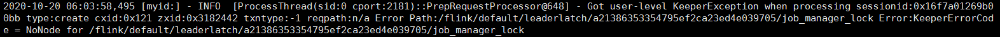

# zookeeper问题
1. 问题点
1. 解决方案：不是zookeeper问题。
原因：因为在flink或kafka向zookeeper获取对应路径的时候，zookeeper发现自身并没有创建这条路径，就会返回以上的错误。其实可以看到这条记录在zookeeper日志中是INFO，并不是error，所以对应的flink或kafka会过滤掉这些错误

[stackoverflow中的解答](https://stackoverflow.com/questions/43559328/got-user-level-keeperexception-when-processing)

# uuid描述记录
