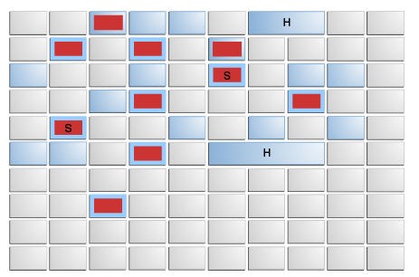
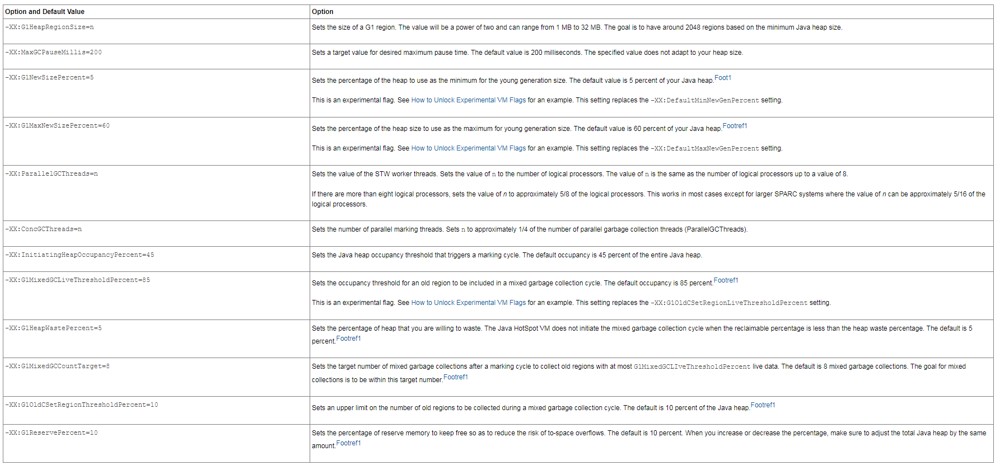
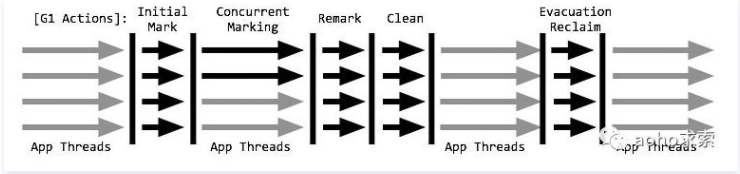
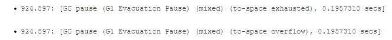

# 定义
一种server-style的垃圾收集器，适用于具有大内存的多处理器计算器

# 名词定义
1. Garbage-First。执行并发全局标记，以确定整个堆中对象的活动性，进而了解哪些区域为空，优先收集区域为空较多的区域。即将收集和压缩活动集中在可能充满可回收对象的堆区域中
2. 并发收集模式问题。
    1. 应用程序分配对象的速度超过垃圾收集器可以回收可用空间的速度
    2. 可用空闲空间块无法满足分配要求
3. SATB。快照技术来找到所有活动对象，类似于CMS增量更新
4. 卡表。Java HotSpot VM使用字节数组作为卡表，每个字节称为卡，卡与堆中的地址范围相对应。
5. Humongous object。任何**大于区域大小一半**的对象，被直接分配到了老年代区域。

# 优势
1. 将对象从堆的一个或多个区域复制到堆上的单个区域，并在此过程中压缩和释放内存
2. 不断减少碎片
3. 为运行需要大型堆（**6GB或更大**）且GC延迟有限的应用程序的用户提供解决方案，可预测的暂停时间低于0.5s

# CMS=>G1
1. JAVA堆被实时数据占用>=50%
2. 对象分配率或提升率差异很大
3. 长时间垃圾收集或压缩暂停>0.5s

# 注意点
G1非实时收集器。

# 堆分区
> Java对象堆被划分为多个大小相等的区域，1MB~32MB不等，不超过2048个区域，内存布局如下图所示

1. 年轻代。浅蓝色区域
2. 混合集合。深蓝色的旧区域
3. 正在收集部分。红色框标记
4. 幸存者区域。标有S
5. 巨大对象。标有H

# 暂停(STW)
1. 年轻代STW只发生在年轻代
2. mixed collection pauses.处理年轻代和老年代混合部分

# 启用方式
1. `-XX:+UseG1GC`
2. `-XX:+ParallelGCThreads=<N>`。STW的工作线程数量，与服务器的核数有关，默认值按(cpu <= 8) ? cpu : 3 + ((cpu * 5) / 8)
3. `-XX:G1MixedGCLiveThresholdPercent=<N>`。混合垃圾收集器中旧区域的占用阀值。
4. `-XX:+UnlockExperimentalVMOptions`。解锁实验性标志的值
5. 其他默认重要的参数配置

# 标记周期

1. Initial marking phase（初始标记阶段）。年轻代垃圾回收器承载
2. Root region scanning phase（根区域扫描阶段）。扫描初始标记阶段标记的幸存者区域
3. Concurrent marking phase（**并发标记阶段**）。查找整个堆中可访问的活动的对象。
4. Remark phase（标记阶段）。STW收集
5. Cleanup phase（**清理阶段【并发】**）。执行计费和RSet清理的STW操作,清理部分为并发完成。

# 收集周期
## 混合收集

## 年轻代
1. 收集eden regions和survivor regions
2. 特定对象的目标区域取决于对象的年龄，升级到老年代
3. 对象包含在下一个年轻代或混合垃圾收集的CSet

# 推荐建议
1. 年轻代大小。避免使用`-Xmn`或`-XX:NewRatio`来显示设置年轻代大小
2. 暂停时间目标。
    1. G1 GC的吞吐量目标是90%的应用时间+10%的垃圾收集时间
    2. 并行收集器的吞吐量目标是99%的应用时间+1%的垃圾收集时间
3. 混合垃圾收集。
    1. `-XX：InitiatingHeapOccupancyPercent`。用于更改标记阈值。
    2. `-XX：G1MixedGCLiveThresholdPercent`和`-XX：G1HeapWastePercent`。用于更改混合垃圾回收决策。
    3. `-XX：G1MixedGCCountTarget`和`-XX：G1OldCSetRegionThresholdPercent`。用于调整旧区域的CSet

# GC问题日志
overflow日志

1. 原因。内存不足
2. 解决方案
    1. 增加`-XX：G1ReservePercent`选项的值（并相应增加总堆），以增加reserve memory 的保留内存量。
    2. 通过减小`-XX：InitiatingHeapOccupancyPercent`的值来更早地开始标记周期。
    3. 增加`-XX：ConcGCThreads`选项的值，以增加并行标记线程的数量。

# 资料参考
1. [Garbage-First Garbage Collector Tuning](https://docs.oracle.com/javase/8/docs/technotes/guides/vm/gctuning/g1_gc_tuning.html#humongous)
2. [详解 JVM Garbage First(G1) 垃圾收集器](https://cloud.tencent.com/developer/article/1459638)
