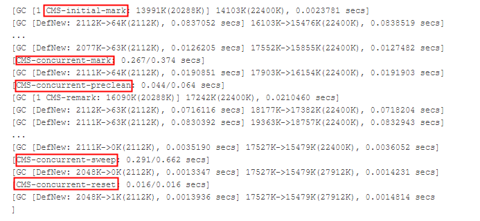

# 定义
为那些希望较短的垃圾收集暂停并且可以在应用程序运行时与垃圾收集器共享处理器资源的应用程序而设计的

# 名词定义
1. 并发收集模式问题。
    1. 无法在使用权产生的一代填满之前完成对无法访问的对象的回收
    2. 可用空闲空间块无法满足分配要求
2. OutOfMemoryError。回收花费耗时太长并且回收的堆小于2%，由于并发收集模式问题或显示`System.gc()`造成的。
3. 浮动垃圾。尚未回收的无法访问的对象，是由于垃圾回收线程与应用线程并发运行造成的，可通过增加老年代空间来解决
4. 增量模式在JDK8中**不推荐**使用

# 启用方式
1. `-XX: +UseConcMarkSweepGC`
2. `-XX:ParallelCMSThreads=<N>`,设定年轻代的并行收集线程数，默认值按(cpu <= 8) ? cpu : 3 + ((cpu * 5) / 8)
3. `-XX:+CMSPermGenSweepingEnabled -XX:+CMSClassUnloadingEnabled`,开启回收Perm区

# 收集周期
## 老年代
1. 初始标记。将从**根**直接访问的对象和从**堆**中其他位置直接标记为**活动对象**
2. 并发标记
3. 重新标记（备注停顿，**耗时**比初始标记长）。处理因应用程序线程更新对象引用而导致的**并发跟踪遗漏**的对象。
4. 并发清除
## 年轻代
并行复制收集器，跟Paralle gc算法

# GC日志格式
指令：`-XX:+PrintGCDetails`和`-verbose:gc`

1. CMS-initial-mark。并发收集周期**开始**标识
2. CMS-concurrent-mark。并发标记阶段**结束**标识
3. CMS-concurrent-sweep。并发清除阶段的结束
4. CMS-concurrent-preclean。预清洁阶段，在准备备注阶段CMS-mark的同时执行的工作
5. CMS-concurrent-reset。正在准备下一个并发收集
6. full gc.
    1. Prommotion failed.
        1. 原因。空间不够且因老年代空间不够无法向其进行转移，导致FULL GC。
        2. 解决方案。调整空间大小
    2. Concurrent mode failed
        1. 原因。老年代被回收太慢。
        2. 解决方案。调小`-XX:CMSInitiatingOccupancyFraction`参数的值

# 资料参考
1. [Concurrent Mark Sweep (CMS) Collector](https://docs.oracle.com/javase/8/docs/technotes/guides/vm/gctuning/cms.html#concurrent_mark_sweep_cms_collector)
