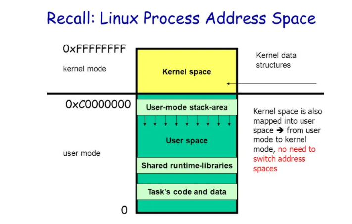
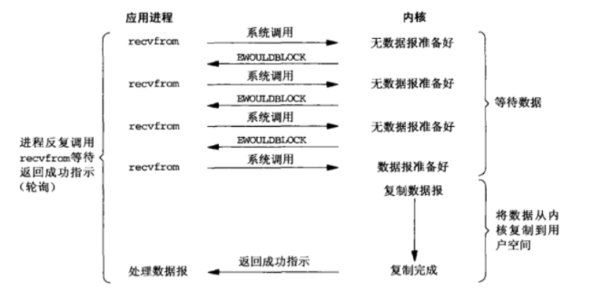
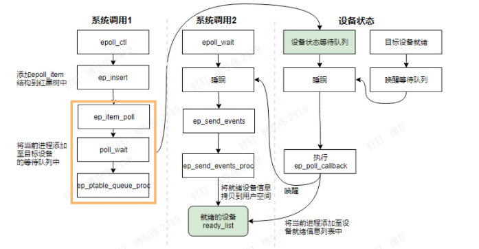
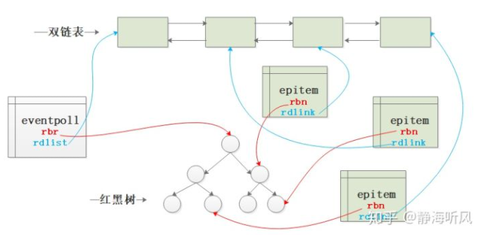
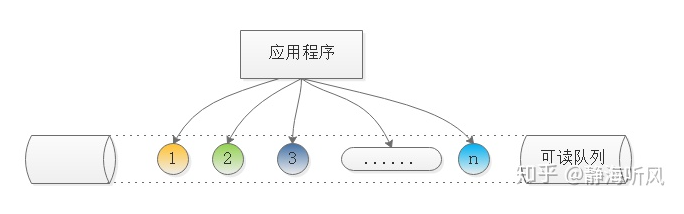

## 名词定义

1. IO 的含义。磁盘 IO 和网络 IO，IO 复用是指网络 IO，在 linux 中通常用文件描述符`FD`来表示
2. 复用。网络环境复用的是任务处理线程，即多个 IO 共用 1 个线程
3. IO 复用技术。协调多个可释放资源的 FD 交替共享任务处理线程完成通信任务，实现多个 FD 对应 1 个任务处理线程。
4. 多路复用。通过有限次的系统调用来实现管理多个网络连接，复用的是系统调用
## 两个阶段
1. 硬件接口道内核态
2. 内核态到用户态
3. 如第一个阶段阻塞，则为**阻塞IO**；两个阶段有一个阻塞则为**同步IO**（linux的epoll、Mac的kqueue），两个阶段都不阻塞则为**异步IO**（window的AIO）

## 用户空间和内核空间

1. 32 位 linux 的寻址空间为 4G
1. 用户空间【3G】。供各个进程使用
1. 内核空间【1G】。供内核使用
   

## Linux 中 IO 复用工具

### IO 模型

1. 分为 5 种 I/O 模型，包括同步和异步 IO：阻塞 IO；非阻塞 IO；IO 多路复用；信号驱动 IO；异步 IO
2. I/O 是用户空间和内核空间的数据交互

### 非阻塞 IO

1. 流程如下：
   
2. 用户进程需要不断的主动询问 kernel 数据好了没有

### I/O 多路复用

1. 定义。支持单一线程同时监听多个文件描述符（I/O 事件），阻塞等待，并在其中某个文件描述符可读写时收到通知
2. 类型。select/poll/epoll
3. 本质。多路复用复用的是线程，即一个线程处理多个连接（I/O 事件）

### selector

- 使用宏定义函数按照 bitmap 原理填充 fd，默认大小为 1024 个【官方不建议超过这个数值】
- 问题点
  1. 可协调 fd 数量和数值都**不超过**1024——无法实现高并发【最大并发数限制】
  1. 使用 O(n)复杂度遍历 fd 数组查看 fd 的可读写性——效率低
  1. 涉及大量 kernel 和用户态拷贝——消耗大
  1. 每次完成监控需要再次重新传入并且分事件传入——操作冗余
- 特点
  1. 可监控的文件描述符个数取决于 sizeof(fd_set) 的值.
  2.

### epoll

- API

1. epoll_create。创建实例返回 epollfd。
2. epoll_ctl。注册 IO 事件到 epoll 实例上
3. epoll_wait。阻塞监听
4. read。
5. write。

- 工作原理
  
- 优势
  1. 对 fd 数量没有限制，只于系统的内存有关
  1. 抛弃了 bitmap 数组实现了新的结构来存储多种事件类型
  1. 无需重复拷贝 fd——随用随加，随弃随删
  1. 采用**事件驱动**避免轮询查看可读写事件
  1. IO 效率不随 FD 数目增加而线性下降
  1. 使用 mmap 加速内核与用户空间的消息传递
- 底层实现
  1. `epitem`。和每个用户态监控 IO 的 fd 对应
  1. `eventpoll`。用户态创建的管理所有被监控 fd 的结构
  1. 流程图如下：
     
- 惊群问题。
  1. 现象。当多个进程/线程调用`epoll_wait`时会阻塞等待，当内核触发可读写事件，**所有进程/线程都会进行相应**，但**实际**只有一个进程/线程真实处理这些事件。
  1. 解决方案。
     - 配置`SO_REUSEPORT`实现内核级的负载均衡
     - 增加`EPOLLEXCLUSIVE`标识，保证一个事件发生时只有一个线程被唤醒【linux 4.5 内核】
- ET 模式和 LT 模式
  1. 默认采用`LT模式`
  1. `LT模式`支持阻塞和非阻塞，`ET模式`只支持非阻塞套接字
  1. `LT的读写操作`。read 没有限制，write 只在有数据**要发送时**才加入 epoll 列表，没有数据需要 write 时需要从 epoll 列表中删除。
  1. `ET的读写操作`。只有**socket 的状态发生变化**是通知，即读取缓冲区由无数据到有数据时通知 read 事件，发送缓冲区由满到未满通知 write 事件
  1. `ET模式的线程饥饿问题`。
     - 现象。在大数量情况下可能造成个别 socket 得不到处理的情况
     - 解决方式。为每个已经准备好的描述符维护一个队列，如下图：
       
  1. `EPOLLONESHOT设置`。保证一个 socket 连接在任一时刻只被一个线程处理。
- 水平触发与边缘触发
  1. 水平触发
  当被监控的文件描述符上有可读写事件发生时，epoll_wait()会通知处理程序去读写。如果这次没有把数据一次性全部读写完(如读写缓冲区太小)，那么下次调用 epoll_wait()时，它还会通知你在上没读写完的文件描述符上继续读写，当然如果你一直不去读写，它会一直通知你！！！如果系统中有大量你不需要读写的就绪文件描述符，而它们每次都会返回，这样会大大降低处理程序检索自己关心的就绪文件描述符的效率
  2. 边缘触发
  当被监控的文件描述符上有可读写事件发生时，epoll_wait()会通知处理程序去读写。如果这次没有把数据全部读写完(如读写缓冲区太小)，那么下次调用epoll_wait()时，它不会通知你，也就是它只会通知你一次，直到该文件描述符上出现第二次可读写事件才会通知你！！！这种模式比水平触发效率高，系统不会充斥大量你不关心的就绪文件描述符！！！
  3. 区别。边缘触发不关心内容是否读完，没读完的数据在第二次调用epoll_wait()不会再通知；而水平触发则相反，对于没读完的数据在第二次调用epoll_wait()时还会再通知

### selector 和 epoll 对比

1.用户态怎么将文件句柄传递到内核态？

- **Selector**。select 创建 3 个文件描述符集，并将这些文件描述符拷贝到内核中，这里限制了文件句柄的最大的数量为 1024（注意是全部传入---第一次拷贝）
- **Epoll**。首先执行 epoll_create 在内核专属于 epoll 的高速 cache 区，并在该缓冲区建立红黑树和就绪链表，用户态传入的文件句柄将被放到红黑树中（第一次拷贝）

  2.内核态怎么判断 I/O 流可读可写？

- **Selector**。内核针对读缓冲区和写缓冲区来判断是否可读可写,这个动作和 select 无关
- **Epoll**。内核针对读缓冲区和写缓冲区来判断是否可读可写，这个动作与 epoll 无关

  3.内核怎么通知监控者有 I/O 流可读可写？

- **Selector**。内核在检测到文件句柄可读/可写时就产生中断通知监控者 select，select 被内核触发之后，就返回可读可写的文件句柄的总数
- **Epoll**。epoll_ctl 执行 add 动作时除了将文件句柄放到红黑树上之外，还向内核注册了该文件句柄的回调函数，内核在检测到某句柄可读可写时则调用该回调函数，回调函数将文件句柄放到就绪链表

  4.监控者如何找到可读可写的 I/O 流并传递给用户态应用程序？

- **Selector**。select 会将之前传递给内核的文件句柄再次从内核传到用户态（第 2 次拷贝），select 返回给用户态的只是可读可写的文件句柄总数，再使用 FD_ISSET 宏函数来检测哪些文件 I/O 可读可写（遍历）
- **Epoll**。epoll_wait 只监控就绪链表就可以，如果就绪链表有文件句柄，则表示该文件句柄可读可写，并返回到用户态（少量的拷贝）

  5.继续循环时监控者怎样重复上述步骤？

- **Selector**。select 对于事件的监控是建立在内核的修改之上的，也就是说经过一次监控之后，内核会修改位，因此再次监控时需要再次从用户态向内核态进行拷贝（第 N 次拷贝）
- **Epoll**。由于内核不修改文件句柄的位，因此只需要在第一次传入就可以重复监控，直到使用 epoll_ctl 删除，否则不需要重新传入，因此无多次拷贝

### epoll 高效的原因

1. 在调用 epoll_create 时，内核除了帮我们在 epoll 文件系统里建了个 file 结点，在内核 cache 里建了个**红黑树**用于存储以后 epoll_ctl 传来的 socket 外，还会再建立一个**list 链表**，用于存储准备就绪的事件。
1. epoll_wait 调用时，仅仅观察这个 list 链表里有没有数据即可。有数据就返回，没有数据就 sleep，等到 timeout 时间到后即使链表没数据也返回

## 资料

1. [Go netpoller 网络模型之源码全面解析](https://mp.weixin.qq.com/s/HNPeffn08QovQwtUH1qkbQ)
2. [网络 IO 演变发展过程和模型介绍](https://cloud.tencent.com/developer/article/1793196)
3. [Chapter 6. I/O Multiplexing: The select and poll Functions](https://www.masterraghu.com/subjects/np/introduction/unix_network_programming_v1.3/ch06.html)