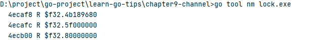

# go 常用指令

## go tool nm

`go tool nm ./lock.exe`。如下图所示：

第一列：内存地址；第二列：类型；第三列：符号

## go 文件转成汇编

`go tool compile -N -l -S xx.go`

## 汇编文件转成 go 文件

`go tool objdump lock.o

## go test

1. `go help test`
2. `go help testflag`

## 代码测试覆盖率

1. `go test -coverprofile=coverage.out`
2. `go tool cover -func=coverage.out`

## go tool trace

> 跟踪程序的执行情况，包括 GC、锁等

1. `go run main.go 2>trace.out`：运行 trace 到输出文件
2. `go tool trace trace.out`

## go doc http

> 展示 golang 的 api 文档

## 资料整理

1. [go-tool-trace](https://eddycjy.gitbook.io/golang/di-9-ke-gong-ju/go-tool-trace)
