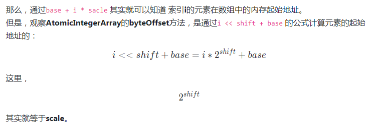

# atomic包

## unsafe类

1. 封装了直接对内存管理、操纵对象、阻塞/唤醒线程等操作
2. native方法，需要通过CAS原子指令完成
3. 类加载器
    1. `Bootstrap类加载器`。主要加载的是JVM自身需要的类
    2. `Extension ClassLoader扩展类加载器`。负责加载ext目录下的类库
    3. `Application ClassLoader系统类加载器`。负责加载用户类路径所指定的类
4. `compareAndSwapInt`中的偏移量字段是为了更方便的查找对象

## AtomicInteger/AtomicBoolean/AtomicLong类

> 三个类只是操作的类型不一样，原理上一致
1. 初始化
```java
static {
        try {
            // value偏移量值的获取
            valueOffset = unsafe.objectFieldOffset
                (AtomicInteger.class.getDeclaredField("value"));
        } catch (Exception ex) { throw new Error(ex); }
    }
```

2. 特殊方法
    - `lazySet`。通过共享变量来改变值，与普通操作变量的方式类似。适用于加锁的场景，可以减少不必要的内存屏障

## AtomicReference

1. 引入类似乐观锁的方式操作共享资源，而非使用锁的方式（悲观）
2. 提供了以无锁方式访问共享资源的能力，以自旋和CAS的方式来解决共享变量的线程安全问题
3. 比较的是对象的引用
```java
class Task implements Runnable {
    private AtomicReference<Integer> ref;

    Task(AtomicReference<Integer> ref) {
        this.ref = ref;
    }
    
    @Override
    public void run() {
        for (; ; ) {    //自旋操作
            Integer oldV = ref.get();   
            if (ref.compareAndSet(oldV, oldV + 1))  // CAS操作 
                break;
        }
    }
}
```

## AtomicStampedReference

> 加了版本号的`AtomicReference`，可以用来解决CAS的ABA问题

## AtomicMarkableReference

> 能识别引用变量是否被更改过，使用**boolean**来标识是否有改过，功能与AtomicStampedReference类似

## AtomicIntegerArray/AtomicLongArray/AtomicReferenceArray

1. 以原子的方式操作数组中的元素
2. 初始化
```java
static {
        // 获取数组中每个元素的占用内存大小
        int scale = unsafe.arrayIndexScale(int[].class);
        if ((scale & (scale - 1)) != 0)
            throw new Error("data type scale not a power of two");
        // 从最左边起，连续0的个数
        shift = 31 - Integer.numberOfLeadingZeros(scale);
    }
```
3. 计算公式


## 资料
1. [atomic](https://segmentfault.com/a/1190000015831791)
2. [unsafe包说明](https://blog.csdn.net/aesop_wubo/article/details/7537278)