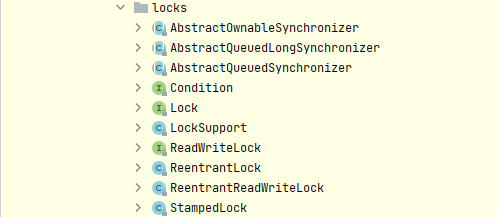
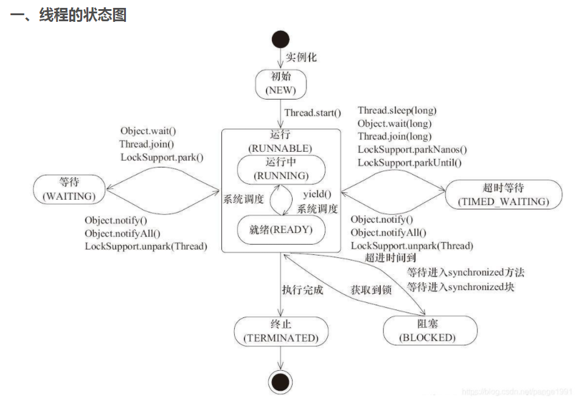
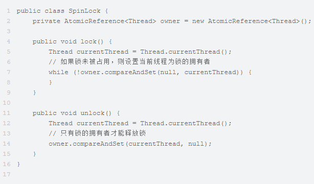
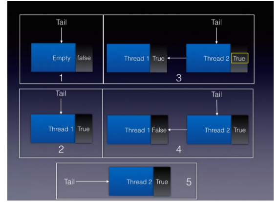
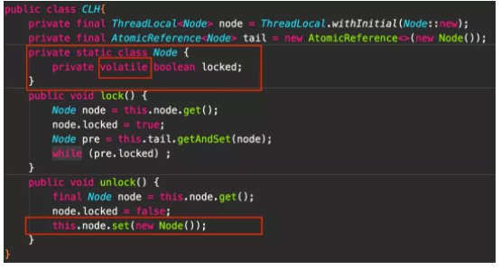
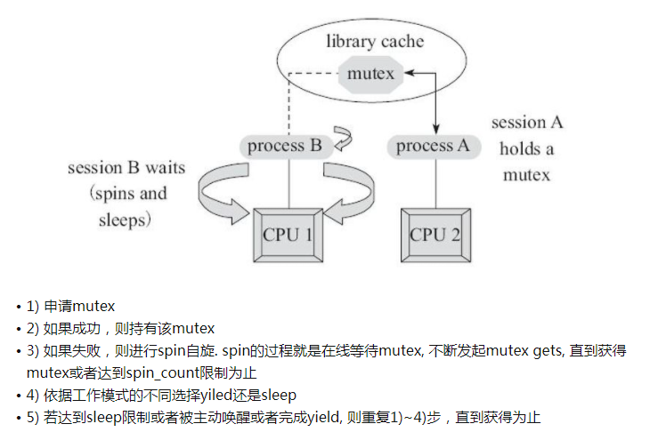

# JAVA Current Lock

## LOCKS 全景图



## 线程的状态

- 新建状态
- 就绪状态
- 运行状态
- 阻塞状态
- 死亡状态
- 中断状态
   1. 如果一个线程阻塞在**wait方法**，或者线程的**join方法**，再或者**sleep方法**上，线程的中断状态被清空设置为false，并且被interrupt的线程将收到一个中断异常。
   2. 如果线程阻塞在IO操作，**channel将被关闭**，并且线程的中断状态会被设置为true，并且被interrupt的线程将收到一个ClosedByInterruptException异常。
   3. 如果线程阻塞在**selector方法**，中断线程的中断状态将设置为true，并且从select操作立即返回，只有selector的wakeup方法被调用可能返回一个非0值。



## 锁的状态

> 锁可以升级但不能降级 

1. 无锁状态
2. 偏向锁状态
3. 轻量级锁状态
4. 重量级锁状态

## 锁的种类

1. 自旋锁。
   
   1. 优点。实现简单，避免了操作系统进程调度和线程上下文切换的开销。
   2. 缺点。
         - 锁饥饿问题。死锁是两个或者多个进程，**相互等待**对方占有的资源，而又不能释放自己的资源
         - 性能问题。
   3. 适用场景
      锁竞争不激烈、锁持有时间短的场景。
   4. 自适应的自旋锁（1.6）
      - 前一次在同一个锁上的自旋时间及锁的拥有者的状态来决定。自旋成功，下次自旋次数会更多；自旋失败，下次自旋次数则会减少
      - 使用场景。轻量级锁通过自适应的自旋锁来升级为重量级锁
2. 互斥锁。
3. CLH锁（自旋锁的改进）。利用严格的FIFO策略避免饥饿问题；利用不同的状态变量中自旋，减少CPU的开销。
4. 悲观锁策略。每一次执行临界区代码都会产生冲突，获取到锁的时候同时会阻塞其他线程获取该锁。
5. CAS操作——乐观锁策略
   1. 问题点。
      - 无法感知检查时中途的变化【ABA问题】
      - 自旋时间过长【死循环】
      - 只能保证一个共享变量的原子操作
6. 偏向锁（乐观锁）。为了在只有一个线程执行同步块时提高性能，适用于无多线程的场景。
7. 轻量级锁（乐观锁）。在线程近乎交替执行同步块时提高性能，即A和B两个线程交替执行。
8. 重量级锁（悲观锁）。如存在同一时间访问同一锁的情况，就会导致轻量级锁膨胀为重量级锁

### 一. lock（接口）

1. 锁是用于通过多线程控制对共享资源的访问工具，一次只有一个线程可以获取锁，并且对共享资源的所有访问都要求获取锁。
2. 在锁定时执行的代码由**try-finally**或**try-catch**保护，以确保在必要时释放锁定

#### 1.1 方法集

1. `lock()`。获得锁，如果锁不可用，则当前线程将被**禁用**以进行线程调度，并处于**休眠状态**
2. `lockInterruptibly()`。尝试获取可被中断的锁，除非当前线程被 interrupted。
   1. 不可用-->可用
         - 锁是由当前线程获取
         - 一些其他线程 interrupts 当前线程，并且支持中断锁获取
   2. 中断清除
         - 进入该方法时设置了中断状态
         - interrupted，同时获取锁，并支持锁中断，然后`InterruptedException`被关上
3. `tryLock()`。非阻塞尝试获取锁（可定时的与可轮询的锁获取模式）
4. `tryLock(long,TimeUnit)`。尝试获取超时锁
   1. 不可用-->可用
         - 锁是由当前线程获取
         - 一些其他线程 interrupts 当前线程，并且支持中断锁获取
         - 指定的等待时间过去了
   2. 中断清除
         - 进入该方法时设置了中断状态
         - interrupted，同时获取锁，并支持锁中断，然后`InterruptedException`被关上
5. `unlock`。释放锁
6. `newCondition()`。返回一个新 Condition 绑定到新 Lock 实例

#### 1.2 内存同步

1. 所有 Lock 实施必须执行与**内置监视器锁**相同的内存同步语义
   - 成功的 lock 操作具有与成功锁定动作相同的内存同步效果。
   - 成功的 unlock 操作具有与成功解锁动作相同的内存同步效果。
2. **不成功的锁定和解锁**操作以及**重入锁定/解锁**操作，不需要任何内存同步效果

#### 1.3 锁定采集

- 可中断
- 不可中断
- 定时

### 二、 ReadWriteLock（接口）

1. 支持**并发访问**共享资源
2. 一个线程成功读锁定将会看到之前发布的写锁定所做的所有更新
3. 适用场景
   1. 读多写少的场景
      `Determining whether to grant the read lock or the write lock, when both readers and writers are waiting, at the time that a writer releases the write lock. Writer preference is common, as writes are expected to be short and infrequent. Reader preference is less common as it can lead to lengthy delays for a write if the readers are frequent and long-lived as expected. Fair, or "in-order" implementations are also possible.`
   2. 是否存在读锁被激活而写锁在等待，可能会降低并发的可能性
      `Determining whether readers that request the read lock while a reader is active and a writer is waiting, are granted the read lock. Preference to the reader can delay the writer indefinitely, while preference to the writer can reduce the potential for concurrency.`
   3. 锁是否可重入
      `Determining whether the locks are reentrant: can a thread with the write lock reacquire it? Can it acquire a read lock while holding the write lock? Is the read lock itself reentrant?`
   4. 是否允许锁降级
      `Can the write lock be downgraded to a read lock without allowing an intervening writer? Can a read lock be upgraded to a write lock, in preference to other waiting readers or writers?`
4. 方法
   1. `readLock()`。读锁
   2. `writeLock()`。写锁

### 三、 Condition（接口）


### 四、 ReentrantLock/ReentrantReadWriteLock

1. 重进入。任意线程在获取到锁之后能购再次获取该锁而不会被锁所阻塞 
2. 与synchronized类似，具有更好的扩展性
3. 定义。由最后成功锁定但尚未解锁的线程所拥有，可以用`isHeldByCurrentThread`和`getHoldCount`来进行检查
4. 在公平锁场景下，不能保证任何特定的执行顺序，更倾向授予**等待时间最长**的线程的访问
5. 未定义时长的`tryLock`支持不公平锁，同一线程下的锁有限制，超过此限制会导致锁定方法异常
6. 利用**AQS**实现同步（包含公平和非公平），默认ReentrantLock为不公平锁，独占锁
7. 方法（除LOCK接口外）
    1. 测试和调试。
         - `getHoldCount`。查询当前线程对该锁的保持数目，此信息只用于测试和调试。0表示没有获取到锁
         - `isHeldByCurrentThread`。查询当前锁是否由当前线程所持有
    2. 系统监控。
        - `isLocked`。查询此锁是否有任何线程保持
        - `getOwner`。返回当前拥有此锁的线程，也有可能为空
        - `hasQueuedThreads`/`hasQueuedThread`/`getQueueLength`/`getQueuedThreads`。查询等待锁的线程队列信息
        - `hasWaiters`/`getWaitQueueLength`/`getWaitingThreads`。根据条件查询等待线程的信息
8. ReentrantReadWriteLock与ReentrantLock的方法类似
9. RRW当线程获取到写锁后，可以降级为读锁

### 五、 StampedLock（1.8）

1. 功能锁，基于三种模式(读、写、乐观读)来控制读/写访问，锁状态基于版本和模式控制，如版本返回0则表示无法获取访问权限，锁的释放和转换需要基于返回版本来控制，不匹配则失败。
2. 三种模式
   - writting==>1。独占锁类似
   - reading==>2。读锁类似
   - Optimistic reading==>3（乐观读模式），乐观读锁在数据一致性上需要复制一个对象
3. 设计为在线程安全组件的开发中用作内部实用程序，采用序列锁的算法，而并非其他锁普遍采用的AQS。利用CLH队列进行线程的管理，通过同步状态值来表示锁的状态和类型。
4. 方法
   1. `tryConvertToReadLock`/`tryConvertToOptimisticRead`/`tryConvertToWriteLock`。锁切换

### 六、AbstractQueuedSynchronizer

> 设计思想：分离构建同步器时的一系列关注点，所有操作都围绕着资源（同步状态）来展开

1. 在JDK1.6后增加了独占锁功能，由`AbstractOwnableSynchronizer`实现
2. 一个框架，用于实现依赖于FIFO等待队列的阻塞锁和相关的同步器（semaphores、events等），为依赖单个原子int值表示状态的同步器提供有用的基础
3. 状态字段的同步操作依赖`getState`、`setState`和`compareAndSetState`的原子操作来更新int值（基于unsafe类库实现）
4. 子类应定义为非公共内部帮助类来实现其封闭类的同步属性方法
5. 默认支持互斥模式或共享模式，等待线程共享FIFO队列
6. ConditionObject类由支持独占模式的子类用作Condition实现
7. 用法（使用`getState`、`setState`、`compareAndSetState`检查和修改同步状态），只支持实现以下方法【线程安全】
    1. tryAcquire。排他获取锁
    2. tryRelease。排他释放锁
    3. tryAcquireShared。共享获取锁
    4. tryReleaseShared。共享释放锁
    5. isHeldExclusively。是否为排他状态
8. *核心*
   1. CLH队列【JSR-166】，FIFO的等待队列。
         
         1. 一个**FIFO的隐式双向队列**，队列中每个节点等待前驱节点释放共享状态（锁）被唤醒就可以了
         2. 从tail入队【原子操作】，head出队【原子操作】
         3. `prev`链用于处理取消
         4. `next`链来实现阻止机制，每个节点的线程ID保留在主机的节点上，则前任通过遍历下一个链接来确定自己是哪个线程。
         5. 在构造节点时，设置头和尾指针。
         6. 问题点。
            1. 如何排队？使用反向链表的形式进行排队，后继节点主动询问，而不是前继节点主动通知，从尾部进行插入
            2. 排队是否公平？公平锁，后申请获取锁的排在队列末尾
            3. 如何唤醒？CLH通过每个线程**自旋**。每个等待线程通过不断自旋前继节点状态判断是否能获取到锁。
         7. 锁的释放和锁定
         
         8. 锁的实现（尾部插入实现）
         
         9. AQS的优化点【基于CLH队列】
            1. 将自旋锁改为基于**LockSupport**的线程阻塞操作
            2. 拓展CLH队列
               1. 扩展每个节点的状态，`volatile int waitStatus`。
                     - CANCELLED[1]。后驱节点被中断或超时，需要移出队列。在同步队列中等待超时或被中断，需要从队列中取消等待，在该状态将不会变化
                     - SIGNAL[-1]。后驱节点被阻塞了，正常等待。后继节点地线程处于等待状态，当前节点释放获取取消同步状态，后继节点地线程即开始运行
                     - CONDITION[-2]。Condition专用
                     - PROPAGATE[-3]。传播，适用于共享模式，下一次共享式同步状态获取将会无条件地被传播下去
                     - IINITAL[0]。初始值
               2. 显式的维护前驱节点和后继节点。锁的释放会去主动唤醒下一个线程
               3. 辅助GC。释放锁时显示设置为null
   2. 同步状态的定义
         1. `getState`。同步返回当前的值
         2. `setState`。同步修改当前值
         3. `compareAndSetHead`/`compareAndSetState`/`compareAndSetTail`/`compareAndSetWaitStatus`/`compareAndSetNext`。使用unsafe类来实现原子操作
   3. 线程的阻塞/唤醒【利用**LockSupport**的park和unpark来实现】
   4. 一次lock的调用过程
      1. 调用**tryAcquire方法**尝试获取锁，获取成功的话修改state并直接返回true，获取失败的话把当前线程加到等待队列**addWaiter**中
      2. 加到等待队列之后先检查前置节点状态是否是signal，如果是的话直接阻塞当前线程等待唤醒，如果不是的话判断是否是cancel状态，是cancel状态就往前遍历并把cancel状态的节点从队列中删除。如果状态是0或者propagate的话将其修改成signal
      3. 阻塞被唤醒之后如果是队首并且尝试获取锁成功就返回true，否则就继续执行前一步的代码进入阻塞
   5. 一次unlock的调用过程
      1. 修改状态位
      2. 唤醒排队的节点
      3. 结合lock方法，被唤醒的节点会自动替换当前节点成为head
9. 源码分析
   1. lock核心
   ```java
      public final void acquire(int arg) {
        if (!tryAcquire(arg) &&
            acquireQueued(addWaiter(Node.EXCLUSIVE), arg))
            selfInterrupt();
    }
   ```
   2. unlock核心
   ```java
      public final boolean release(int arg) {
        if (tryRelease(arg)) {
            Node h = head;
            if (h != null && h.waitStatus != 0)
                unparkSuccessor(h);
            return true;
        }
        return false;
    }
   ```
   3. enq（尾部入队）
   ```java
   private Node addWaiter(Node mode) {
        Node node = new Node(Thread.currentThread(), mode);
        // Try the fast path of enq; backup to full enq on failure
        Node pred = tail;
        // cas入尾队列，如不行则在调用enq入队
        if (pred != null) {
            node.prev = pred;
            if (compareAndSetTail(pred, node)) {
                pred.next = node;
                return node;
            }
        }
        enq(node);
        return node;
    }
   ```
   10. 其他实现
      - `CountDownLatch`。计数使用，一旦降为0，无法重置。
         1. 场景。
            - 作为一个开关或入口【初始值设为1】
            - 作为一个完成信号。
            - 将问题分成N个部分，当所有子任务完成后才能通过等待
         2. 内存一致性影响。在计数达到零之前，一个线程调用`countDown`方法之前，一定有一个线程成功调用了`await`方法
         3. 方法
            - `await()`。等当前线程等待，直到锁存器递减计数到0为止，状态state>0时阻塞，线程需要等待。
            - `countDown()`。减少锁存器的计数，如果计数达到0，则释放所有等待线程，state==0时，资源可用。
            - 由AQS来进行计数，采用共享锁模式。一旦被唤醒，会向队列后部传播（**Propagate**）状态，以实现共享结点的连续唤醒
            ```java
            private static final class Sync extends AbstractQueuedSynchronizer {
               private static final long serialVersionUID = 4982264981922014374L;

               Sync(int count) {
                     setState(count);
               }

               int getCount() {
                     return getState();
               }

               protected int tryAcquireShared(int acquires) {
                     return (getState() == 0) ? 1 : -1;
               }

               protected boolean tryReleaseShared(int releases) {
                     // Decrement count; signal when transition to zero
                     // 执行自旋锁并CAS
                     for (;;) {
                        int c = getState();
                        if (c == 0)
                           return false;
                        int nextc = c-1;
                        
                        if (compareAndSetState(c, nextc))
                           return nextc == 0;
                     }
               }
            }
            ```
         4. 资料
            - [CountDownLatch源码分析](https://segmentfault.com/a/1190000015807573)
      - `CyclicBarrier`。与`CountDownLatch`类似，区别是支持数值重置，允许一组线程全部相互等待以到达一个公共的屏障点。
         1. 场景。
            - 涉及固定大小的线程方的程序中使用。
            - 若其中一个线程出现异常，则所有线程都会以`BrokenBarrierException`异常退出【all-or-none breakage model】
         2. 内存一致性影响。一个线程调用`await`方法之前，一定有一个线程成功调用了`await`方法
         3. 方法【一个栅栏对应一个generation对象，对象包含一个broken值来标识】
            - `await`。直到所有各方都在此栅栏上调用了await，核心逻辑在`doawait`方法里
            - `reset`。先break，在重新创建新的generation对象
            - 使用`ReentrantLock`和`Condition`来实现
         4. 资料
            - [CyclicBarrier源码分析](https://segmentfault.com/a/1190000015888316?utm_source=sf-related)
      - `semaphore`。维护一组许可证，通过`acquire`和`release`方法来对许可证进行获取和释放，在未获取到许可时，线程将一直等待。支持公平与非公平，在非公平状态下不保证获得许可的顺序；公平策略支持FIFO来选择许可。默认为**非公平策略**设置
         1. 场景。用于限制线程的数量
            - 公平策略适用于控制资源访问
            - 非公平策略适用于与其他类型的同步控制，提高吞吐量
         2. 二进制信号量。指初始化为**1**的信号量，具有与**Lock**类似的功能，但这个信号量**并不从属于**某个线程
         3. 内存一致性影响。调用一个线程的`release`之前，一定有其他线程的**acquire**已经成功触发
         4. 方法【AQS的共享模式】
            - `aquire`。从信号量汇总获取许可证，如果没有或线程未被其他线程interrupted则阻塞，许可证<0时资源不可用
            - `acquireUninterruptibly`。与`aquire`不同的是不支持线程的interrupted，即如果被其他线程interrupted，仍将继续阻塞；只能依赖其他线程的release操作
            - `tryAcquire`。即使信号量被设置为公平，该方法仍可立即获得许可证，若要遵守公平，则需要使用`tryAcquire(0,TimeUnit.SECONDS)`
            - `release`。释放许可证。
            - `availablePermits`。获取可用的许可数量，这个值会实时变化
            - `drainPermits`。获取可用的许可数量，并将可用值置为0
         5. 资料
            - [Semaphore源码分析](https://segmentfault.com/a/1190000015918459)
### 七、AbstractOwnableSynchronizer（1.6）

> 基础类，为AQS提供了独占锁等概念。包含定义拥有独占访问权限的锁

### 八、LockSupport

1. 创建锁和其他同步类的基本线程阻塞原语
2. 重点关注`park`方法和`unpark`方法，不能累加许可（与Semaphore不同）
3. 方法（都依赖unsafe包中对应的方法来进行控制）
   1. `park`。禁止当前线程被调度除非得到许可，使用unsafe.pack包来实现，响应中断但不抛出异常。一般要放在一个**循环判断体**里面
   2. `unpark`。为给定的线程提供许可
   3. `getBroker`。返回提供给最近调用尚未解除阻塞的park方法的阻止程序对象，如果不阻止则返回null。 返回的值只是一个瞬间的快照 - 线程可能已经被阻止或阻止在不同的阻止对象上。

## synchronized（锁定的方法块）

1. 提供对与每个对象相关联的隐式监视器锁的访问，但强制所有锁获取和释放以块结构的方式发生
2. 当获取多个锁时，它们必须以**相反的顺序**被释放，并且所有的锁都必须被释放在与它们相同的词汇范围内。
3. 策略。一个对象对一个以上的线程可见，则对该对象变量的所有读取或写入均通过同步方法完成。
4. 每个对象拥有一个计数器，当线程获取该对象锁后，计数器就会加一，释放锁后就会将计数器减一，如果获取锁失败，就要**阻塞等待**，直到另一个线程释放为止。
5. 利用java的指令集实现的锁，通过monitorenter和monitorexit jvm指令【监视器锁】来完成的，而监视器锁底层依赖于操作系统的Mutex Lock（互斥锁）来实现。
6. 锁消除。利用逃逸技术删除不必要的加锁操作。【逃逸分析。一种确定指针动态范围的静态分析，它可以分析在程序的哪些地方可以访问到指针】
7. synchronized锁
   - 偏向锁（乐观锁）。为了在只有一个线程执行同步块时提高性能，适用于无多线程的场景。特点。只有等到线程竞争出现才释放偏向锁，持有偏向锁的线程不会主动释放偏向锁。
   - 轻量级锁（乐观锁）。在线程近乎交替执行同步块时提高性能，即A和B两个线程交替执行。
   - 重量级锁（悲观锁）。如存在同一时间访问同一锁的情况，就会导致轻量级锁膨胀为重量级锁，指向互斥量（mutex），底层通过操作系统的**mutex lock**实现。等待锁的线程会被阻塞，由于Linux下Java线程与操作系统内核态线程一一映射，所以涉及到**用户态和内核态的切换**、操作系统内核态中的线程的阻塞和恢复。
8. Mutex Lock

> 任一时刻只能有一个线程访问该对象

- 定义。用于保护临界区，确保同一时间只有一个线程访问数据
- 工作方式。


9. 资料
   - [synchronized总结（推荐）](https://zhuanlan.zhihu.com/p/29866981)

## 资料整理

1. [jdk8 内存模型](https://docs.oracle.com/javase/specs/jls/se8/html/jls-17.html#jls-17.4)
2. [java se8 中文版](https://www.matools.com/api/java8)
3. [史上最全的 Java 并发系列](https://juejin.cn/post/6844904047305031693)
4. ~~[JUC 同步队列](https://segmentfault.com/a/1190000018948010)~~
5. [JUC 同步队列](https://segmentfault.com/blog/ressmix_multithread?page=1)
6. [面试](https://blog.csdn.net/qq_34337272/article/details/81252853)
7. ~~[CLH队列](https://www.infoq.cn/article/BVPvyVxjKM8ZSTSpTi0L?utm_source=rss&utm_medium=article)~~
8. [Java锁的种类以及辨析](http://ifeve.com/java_lock_see2/)
9. [ReentrantLock源码分析](http://ifeve.com/juc-aqs-reentrantlock/)
10. ~~[线程状态](https://docs.oracle.com/javase/8/docs/api/java/lang/Thread.State.html)~~
11. [JAVA互斥锁(synchronized&Lock)：行为分析及源码](http://ifeve.com/java%e4%ba%92%e6%96%a5%e9%94%81synchronizedlock%ef%bc%9a%e8%a1%8c%e4%b8%ba%e5%88%86%e6%9e%90%e5%8f%8a%e6%ba%90%e7%a0%81/)
12. [synchronized简介](https://www.cnblogs.com/wangwudi/p/12302668.html)
13. [深入图解AQS实现原理和源码分析](https://blog.csdn.net/Seky_fei/article/details/106111832?utm_medium=distribute.pc_relevant.none-task-blog-BlogCommendFromMachineLearnPai2-1.control&depth_1-utm_source=distribute.pc_relevant.none-task-blog-BlogCommendFromMachineLearnPai2-1.control)
