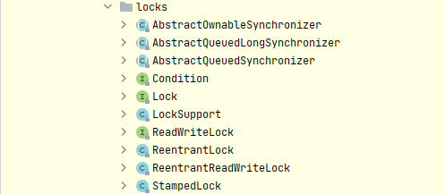

# 一、locks包
## 1.全景图

## 2. lock（接口）
1. 锁是用于通过多线程控制对共享资源的访问工具，一次只有一个线程可以获取锁，并且对共享资源的所有访问都要求获取锁。
2. 在锁定时执行的代码由**try-finally**或**try-catch**保护，以确保在必要时释放锁定

### 2.1 方法集
1. `lock()`。获得锁，如果锁不可用，则当前线程将被**禁用**以进行线程调度，并处于**休眠状态**
2. `lockInterruptibly`。尝试获取可被中断的锁，除非当前线程被interrupted。
    1. 不可用-->可用
        1. 锁是由当前线程获取
        2. 一些其他线程interrupts当前线程，并且支持中断锁获取
    2. 中断清除
        1. 进入该方法时设置了中断状态
        2. interrupted，同时获取锁，并支持锁中断，然后`InterruptedException`被关上
3. `tryLock()`。非阻塞尝试获取锁
4. `tryLock(long,TimeUnit)`。尝试获取超时锁
    1. 不可用-->可用
        1. 锁是由当前线程获取
        2. 一些其他线程interrupts当前线程，并且支持中断锁获取
        3. 指定的等待时间过去了
    2. 中断清除
        1. 进入该方法时设置了中断状态
        2. interrupted，同时获取锁，并支持锁中断，然后`InterruptedException`被关上
5. `unlock`。释放锁
6. `newCondition()`。返回一个新Condition绑定到新实例Lock实例

### 2.2 内存同步
1. 所有Lock实施必须执行与**内置监视器锁**相同的内存同步语义
    1. 成功的lock操作具有与成功锁定动作相同的内存同步效果。
    2. 成功的unlock操作具有与成功解锁动作相同的内存同步效果。
2. **不成功的锁定和解锁**操作以及**重入锁定/解锁**操作，不需要任何内存同步效果

### 2.3 锁定采集
1. 可中断
2. 不可中断
3. 定时

## 3. ReadWriteLock（接口）
1. 支持**并发访问**共享资源
2. 一个线程成功读锁定将会看到之前发布的写锁定所做的所有更新
3. 适用场景
    1. 读多写少的场景
    `Determining whether to grant the read lock or the write lock, when both readers and writers are waiting, at the time that a writer releases the write lock. Writer preference is common, as writes are expected to be short and infrequent. Reader preference is less common as it can lead to lengthy delays for a write if the readers are frequent and long-lived as expected. Fair, or "in-order" implementations are also possible.`
    2. 是否存在读锁被激活而写锁在等待，可能会降低并发的可能性
    `Determining whether readers that request the read lock while a reader is active and a writer is waiting, are granted the read lock. Preference to the reader can delay the writer indefinitely, while preference to the writer can reduce the potential for concurrency.`
    3. 锁是否可重入
    `Determining whether the locks are reentrant: can a thread with the write lock reacquire it? Can it acquire a read lock while holding the write lock? Is the read lock itself reentrant?`
    4. 是否允许锁降级
    `Can the write lock be downgraded to a read lock without allowing an intervening writer? Can a read lock be upgraded to a write lock, in preference to other waiting readers or writers?`
4. 方法
    1. `readLock()`。读锁
    2. ·writeLock()`。写锁
## 4. Condition（接口）

## 5. ReentrantLock/ReentrantReadWriteLock
1. 重进入。任意线程在获取到锁之后能购再次获取该锁而不会被锁所阻塞

## 6. StampedLock（1.8）

# 二、synchronized
1. 提供对与每个对象相关联的隐式监视器锁的访问，但强制所有锁获取和释放以块结构的方式发生
2. 当获取多个锁时，它们必须以**相反的顺序**被释放，并且所有的锁都必须被释放在与它们相同的词汇范围内。

# 资料整理
1. [jdk8 内存模型](https://docs.oracle.com/javase/specs/jls/se8/html/jls-17.html#jls-17.4)
2. [java se8 中文版](https://www.matools.com/api/java8)
3. [史上最全的Java并发系列](https://juejin.cn/post/6844904047305031693)