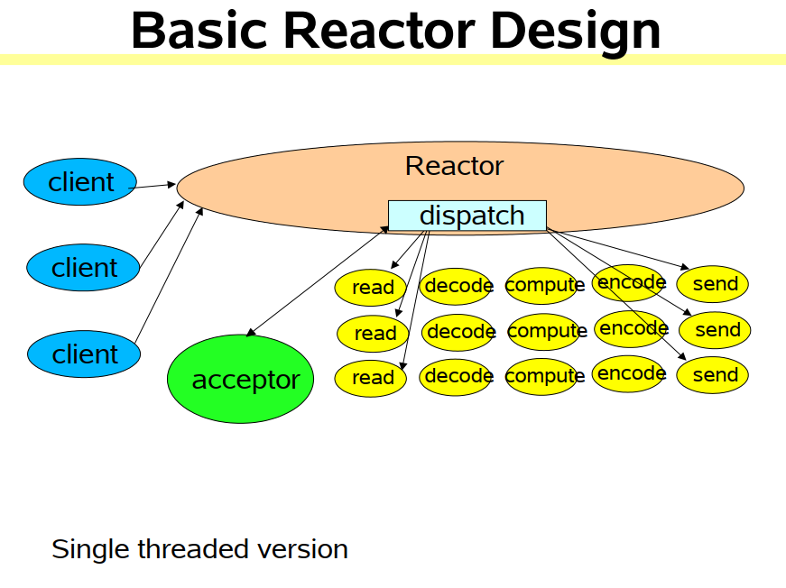
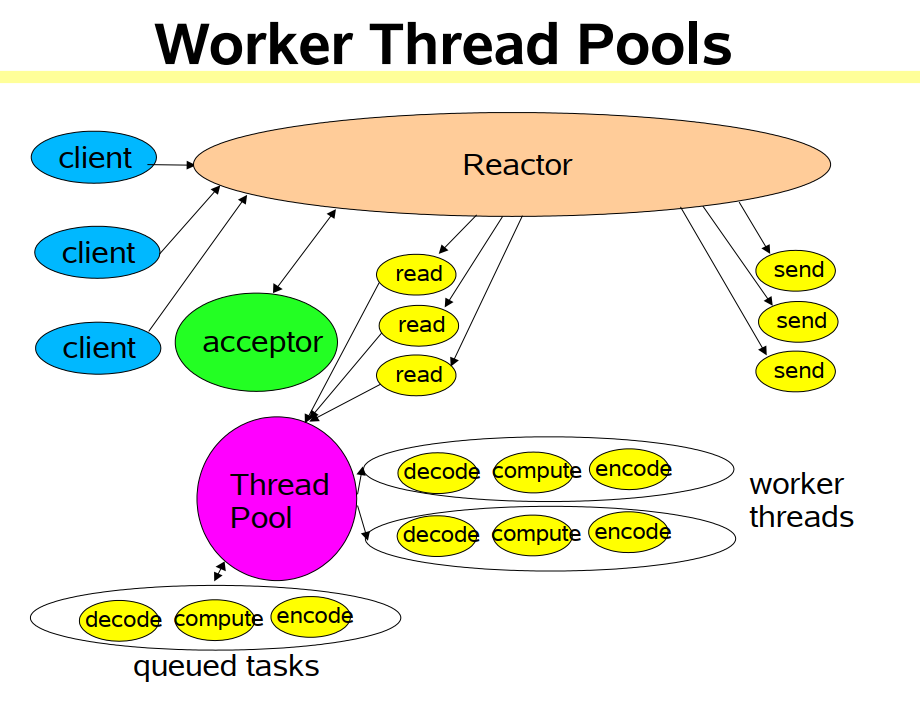
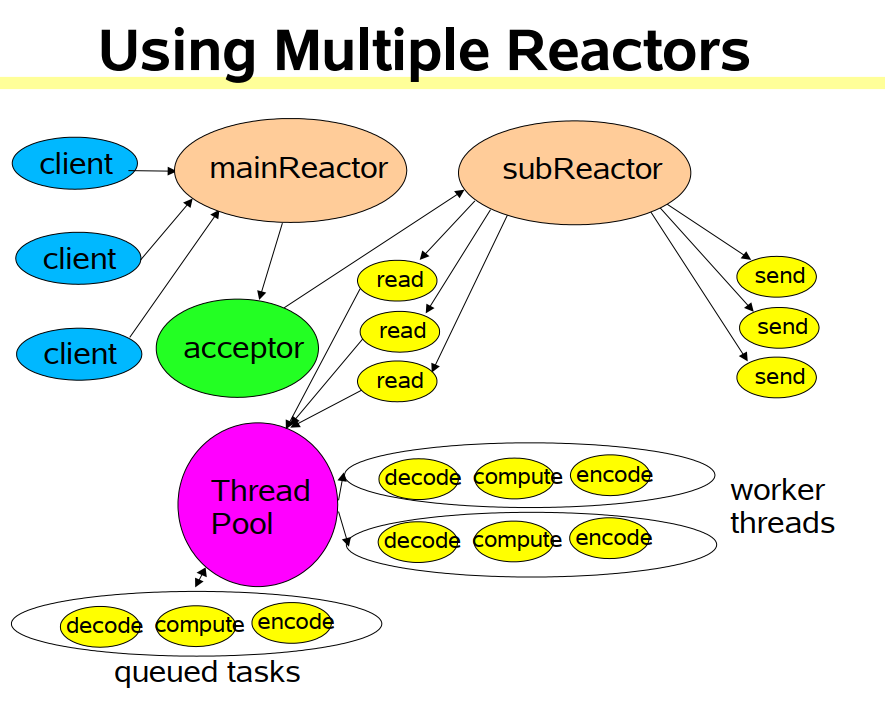
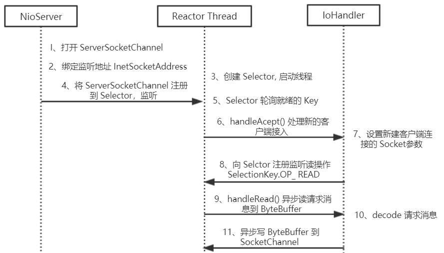

# reactor模型
## 单线程reactor模型

### java nio support
1. `Channels`。连接文件、socket等支持非阻塞读取
1. `Buffers`。表示直接从`channels`中读取或写入的数组对象
1. `Selectors`。表示哪些`Channel`集合存在IO事件
1. `SelectionKeys`。用于维持IO事件的状态和绑定关系

## 多线程单reactor模型

1. 工作线程。reactors需要快速触发handlers,非IO处理转移到其他线程上

## 多线程多reactor模型

1. 由主acceptor分配到其他reactor去处理

# nio其他功能
1. 支持每个reactor包含多个selectors，简单流程介绍如下：向一个Selector中注册了Channel后，由selector自动来判断查询这些channel是否有已就绪的IO事件
1. 文件转移。自动化从文件到网络或网络到文件的拷贝
1. 内存文件映射。利用`buffers`来处理文件，`channel`总是从`Buffer`中读取数据或写入数据
1. `Direct buffers`。
    1. 支持零拷贝；
    1. 在开启或结束时有开销，所分配的内存不在JVM堆上；
    1. 用于长连接。
1. `Non-Direct Buffer`。
    1. 直接在JVM堆上进行内存的分配。本质为byte[]数组
    1. 存在内存拷贝问题，效率低
1. `Channel`类型
    1. FileChannel：文件操作【同步】
    1. DatagramChannel：UDP操作
    1. SocketChannel：TCP操作
    1. ServerSocketChannel：TCP操作，使用在服务器端
1. `Channel事件`
    - Connect, 即连接事件(TCP 连接), 对应于SelectionKey.OP_CONNECT
    - Accept, 即确认事件, 对应于SelectionKey.OP_ACCEPT
    - Read, 即读事件, 对应于SelectionKey.OP_READ, 表示 buffer 可读.
    - Write, 即写事件, 对应于SelectionKey.OP_WRITE, 表示 buffer 可写.
1. `Selector`的基本使用流程

    1. 通过`Selector.open()`打开一个`Selector`.
    1. 将`Channel`注册到`Selector`中, 并设置需要监听的事件(interest set)
    1. 不断重复:
        - 调用`select()`方法
        - 调用`selector.selectedKeys()`获取selected keys
        - 迭代每个 selected key:
        - *从`selected key`中获取 对应的`Channel`和附加信息(如果有的话)
        - *判断是哪些 IO 事件已经就绪了, 然后处理它们. **如果是 OP_ACCEPT 事件, 则调用 "SocketChannel clientChannel = ((ServerSocketChannel) key.channel()).accept()" 获取 SocketChannel, 并将它设置为 非阻塞的, 然后将这个 Channel 注册到 Selector 中.**
        - *根据需要更改 selected key 的监听事件.
        - *将已经处理过的 key 从 selected keys 集合中删除.