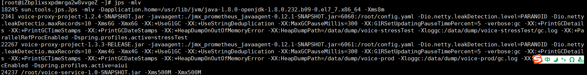
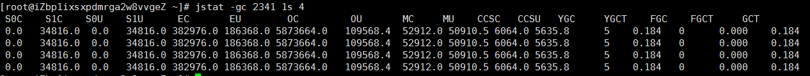

# jps
> 打印所有正在运行的 Java 进程的相关信息。

`jps -mlv`

# jstat
> 打印目标Java进程的性能数据

`jstat -gcutil <PID> ls 3`

# jmap
> 分析Java虚拟机堆中的对象

`jmap -histo:live <pid>`：查看堆中存活的对象
`jmap -dump:live,format=b,file=<xxxx> <pid>`：导出Java虚拟机堆的快照

# jinfo
> 可用来查看目标Java进程的参数

`jinfo <pid>`

# jstack
> 用来打印目标 Java 进程中各个线程的栈轨迹，以及这些线程所持有的锁

`jstack <pid>`