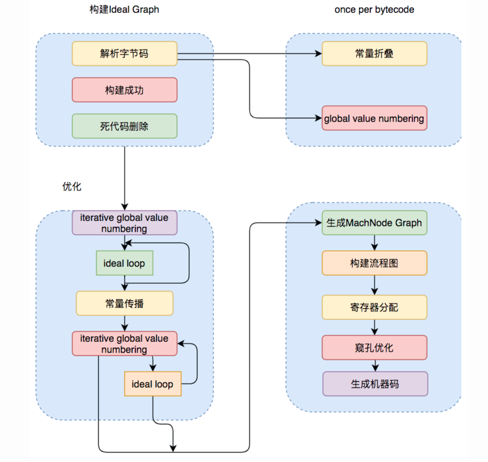
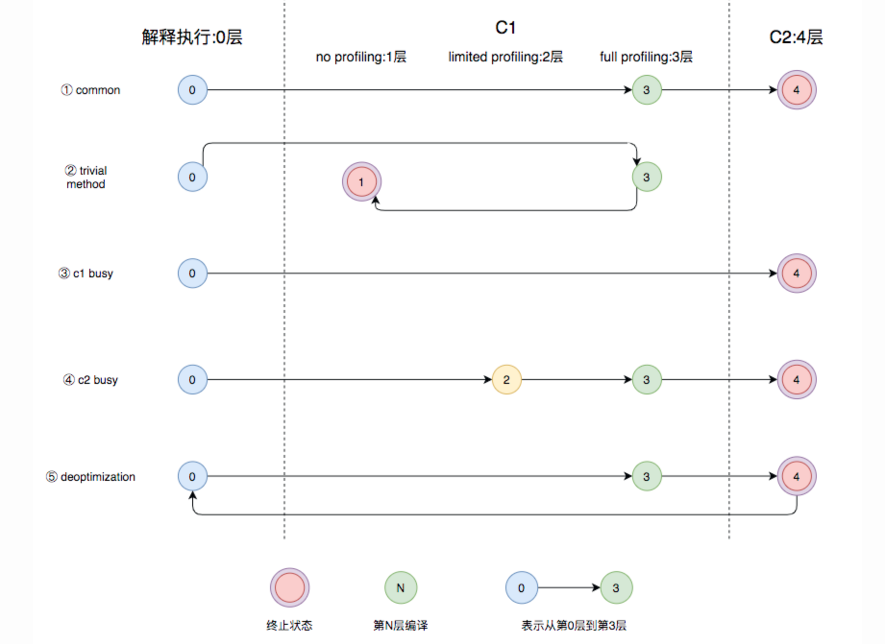

# Java 即时编译器原理解析及实践

## 定义

即时编译器将代码编译优化成本地代码，来获取更高的执行效率

## 编译器

### Client Compiler

> C1 编译器。注重启动速度和局部的优化

1. 局部简单可靠的优化
2. 将字节码构造成高级中间标识
3. 将 HIR 转换成低级中间标识，最终生成机器码

### Server Compiler

1. C2 编译器

2. Graal 编译器【JDK9 以后】

### 分层编译

1. 解释执行
2. 执行不带 profiling 的 C1 代码
3. 执行仅带方法调用次数及循环回边执行次数 profiling 的 C1 代码
4. 执行带所有 profiling 的 C1 代码
5. 执行 C2 代码
   

### 总结

C1 的编译速度更快，C2 的编译质量更高

## 编译优化

### 逃逸分析

> 一种确定指针动态范围的静态分析，可以分析在程序的哪些地方可以访问到指针

1. 锁消除。
2. 栈上分配。
3. 部分逃逸分析。

### Loop Transformations

1. 循环展开
   > 循环转换技术，试图以牺牲程序二进制码大小为代价来优化程序的执行速度，一种用空间换时间的优化手段
2. 循环分离
   > 把循环中一次或多次的特殊迭代分离出来，在循环外执行

## 实践

1. jvm 参数调整
   - -XX:+TieredCompilation：开启分层编译，JDK8 之后默认开启
   - -XX:+CICompilerCount=N：编译线程数，设置数量后，JVM 会自动分配线程数，C1:C2 = 1:2
   - -XX:TierXBackEdgeThreshold：OSR 编译的阈值
   - -XX:TierXMinInvocationThreshold：开启分层编译后各层调用的阈值
   - -XX:TierXCompileThreshold：开启分层编译后的编译阈值
   - -XX:ReservedCodeCacheSize：codeCache 最大大小
   - -XX:InitialCodeCacheSize：codeCache 初始大小
2. JITwatch 分析
   - -XX:+UnlockDiagnosticVMOptions
   - -XX:+PrintCompilation
   - -XX:+PrintInlining
   - -XX:+PrintCodeCache
   - -XX:+PrintCodeCacheOnCompilation
   - -XX:+TraceClassLoading
   - -XX:+LogCompilation
   - -XX:LogFile=LogPath
3. 使用 Graal 编译器

## 资料

1. [Java 即时编译器原理解析及实践](https://tech.meituan.com/2020/10/22/java-jit-practice-in-meituan.html)
