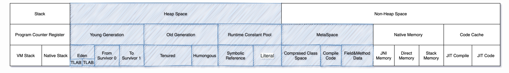
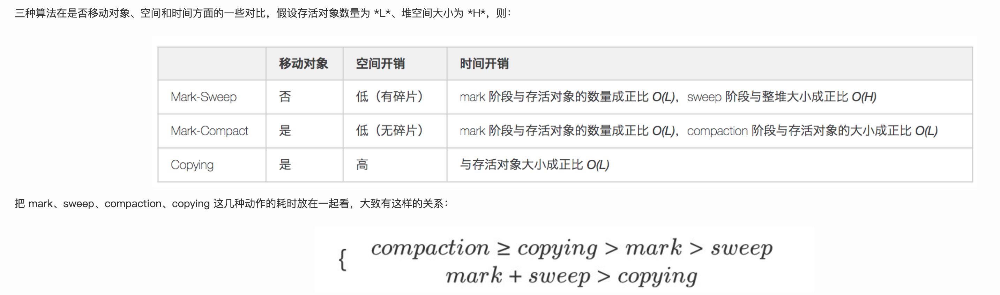
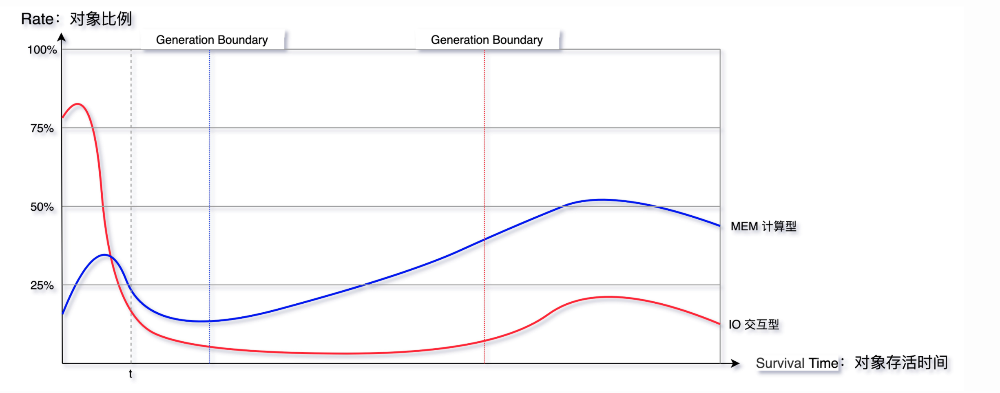
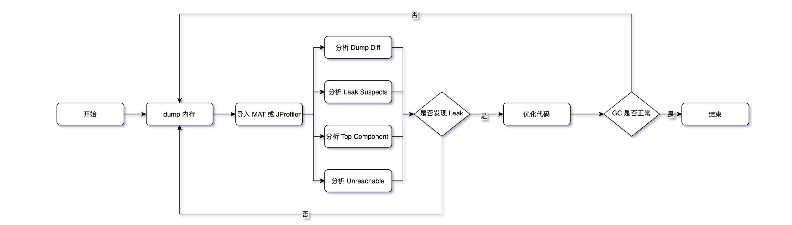
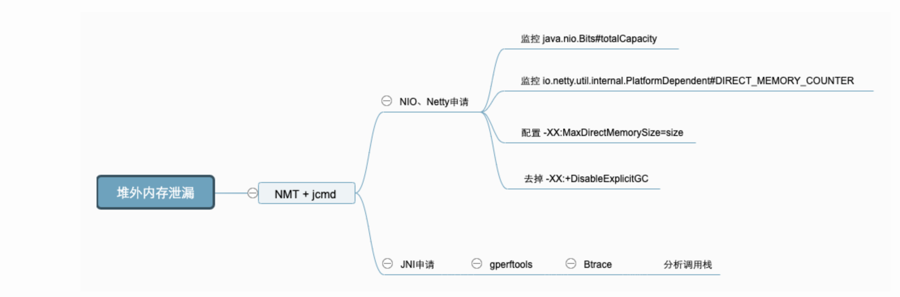
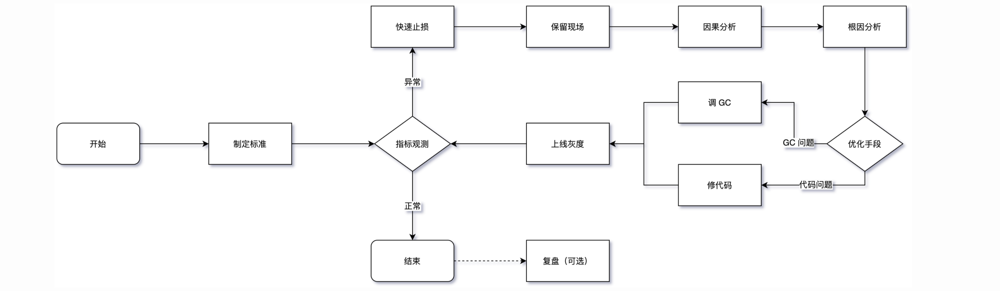
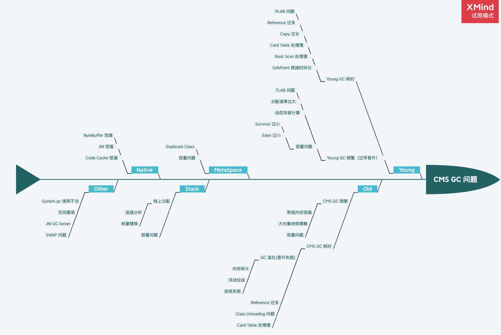
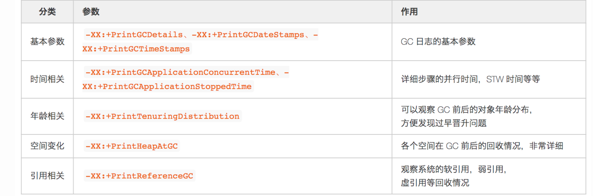

## 运行时数据区域

1. 线程运行时不会因为扩展而导致内存溢出
2.

### 程序计数器

一块较小的内存空间，是当前线程所执行的字节码的行号指示器

### java 虚拟机栈

存放编译期可知的各种 java 基本数据类型、对象引用和 returnAddress 类型

### 本地方法栈

为虚拟机使用到的本地方法服务

### java 堆

1. 虚拟机所管理的内存中最大的一块
2. 被所有线程共享的一块内存区域
3. 唯一目的用于存放对象实例

### 方法区

1. 被各个线程所共享的内存区域
2. 用于存储被虚拟机加载的类型信息、常量、静态变量、即时编译器编译后的代码缓存等

   ### 永久代

   1. 在 HotSpot 虚拟机上开发、部署程序
   2. 存在`-XX:MaxPermSize`的上限
   3. 逐步被本地内存所取代

   #### 运行时常量池

   用于存放编译期生成的各种字面量与符号引用

   ### 元数据

   1. `-XX:MaxMetaspaceSize`。设置元空间最大值，默认为-1（只限制与本地内存大小）
   2. `-XX:MetaspaceSize`。指定元空间的初始空间大小
   3. `-XX:MinMetaspaceFreeRatio`。在垃圾收集之后控制最小的元空间剩余容量的百分比。

### 直接内存

分配不受 Java 堆大小的限制

## 内存划分

1. 内存布局分为三个部分

   1. 对象头。
      1. 用于存储对象自身的运行时数据【Mark Word】
      2. 类型指针。对象指向它的类型元数据的指针
   2. 实例数据。对象真正的有效信息，在程序代码里面定义的各种类型的字段内容
   3. 对齐填充，
      

1. 蓝色部分为 GC 主要工作区
1. Direct Memory 中，分配内存不够时 GC 通过`Cleaner#clean`间接管理

- 任何自动内存管理系统都会面临的步骤：为新对象分配空间，收集垃圾对象空间

## 分配对象

1. **空闲列表**。从列表中足够大的空间划分给对象实例，并更新列表上的记录。通过额外的存储记录空闲的地址，将随机 IO 变为顺序 IO
1. **碰撞指针**。通过一个指针作为分界点，需要分配内存时，仅需把指针往空闲的一端移动与对象大小相等的距离，分配效率较高，但使用场景有限。【带空间压缩整理的收集器】
1. 虚拟机采用 CAS 配上失败重试的方式保证更新操作的原子性。
1. 本地线程分配缓存。每个线程在 Java 堆中预先分配一小块内存

## 收集对象

### 识别垃圾

1. 引用计数法【早期使用】。对每个对象的引用进行计数，多线程环境下同步代价高，能处理循环引用问题。相互引用无法进行回收。
1. **可达性分析（引用链法）**。从 GC Root 开始进行对象搜索，被搜索到的对象即为可达对象。
   1. 可作为 GC Root 的对象。
      1. 引用的对象
      2. 类静态属性引用的对象
      3. 常量引用的对象
      4. JNI 引用的对象
      5. 内部的引用机制
      6. 所有被同步锁持有的对象
      7. 反映虚拟机内部情况的对象
1. 引用
   1. 分类
      1. 强引用。指程序代码中 new 的引用赋值
      2. 软引用。一些有用但非必须的对象
      3. 弱引用。比软引用更弱，生命周期为下一次垃圾收集为止
      4. 虚引用。最弱的引用关系，为了能在这个对象被收集器回收时收到一个系统通知
1. 任何对象的 finalize()方法都只会被系统自动调用一次
1. 方法区回收
   1. 废弃的常量。
      1. 已回收的实例
      2. 类加载器已被回收
      3. 类对应的 java.lang.Class 对象没有在任何地方呗引用
   2. 不再使用的类型
   3. `-verbose:class`和`-XX:+TraceClassLoading`来查看类加载信息

### HotSpot 细节实现

1. 根节点枚举都必须暂停用户线程（STW）；必须在一个能保障一致性的快照中得以进行
2. 安全点。以是否具有让程序长时间执行的特征为标准进行选取
   1. 抢先式中断。没有虚拟机采用
   2. 主动式中断。设置标记，由各个执行线程不停地主动轮询，发现中断标志即就近的安全点进行挂起
3. 安全区域。
4. 记忆集与卡表
   1. 记忆集。用于避免把整个老年代加进 GC Roots 扫描范围，用于记录从非收集区域指向收集区域的指针集合的抽象数据结构
   2. 记忆精度包含字长精度、对象精度和卡精度【卡表】
   3. 卡页。以 2 的 N 次幂的字节数
5. 写屏障
6. 并发的可达性
   1. 三色标记
      1. 白色。对象尚未被垃圾收集器访问过
      2. 黑色。已经被垃圾收集器访问过
      3. 灰色。对象虽已被拉结收集器访问过，但对象本身仍存在至少一个引用

### 收集算法

1. Mark-Sweep（标记-清除）。
   1. 追踪阶段。标记每个遇到的对象。
   1. 清除阶段。将所有未标记的对象进行回收。
1. Mark-Compact（标记-整理）。
   1. 与 Mark-Sweep 第一阶段类似。
   1. 按存活对象按照整理顺序进行整理。
1. Copying（复制）。通过碰撞指针的方式进行快速地分配内存。
   

## GC 评价标准

1. **延迟（Latency）**。最大停顿时间，即垃圾收集过程中一次 STW 的最长时间，越短越好，一定程度上可以接受频次的增大。
1. **吞吐量（Throughput）**。应用 GC 耗时占系统总运行时间的百分比，吞吐量优先的收集器可以接受较长的停顿。一次停顿的时间不超过应用服务的 TP9999，GC 的吞吐量不小于 99.99%
1. **Footprint（资源量大小测量）**。
1. **反应速度**。
   

## GC Cause

1. **System.gc()**。手动触发 GC 操作
1. CMS。重点关注**CMS Initial Mark**和**CMS Final Remark**两个 STW 阶段
1. **Promotion Failure**。Old 区没有足够的空间分配给 Young 区晋升的对象。
1. **Concurrent Mode Failure**。Old 区预留的空间不足以分配给新的对象，此时收集器会发生退化，严重影响 GC 性能。
1. **GCLocker Initiated GC**。如果线程执行在 JNI 临界区时，刚好需要进行 GC，此时 GC Locker 将会阻止 GC 的发生，同时阻止其他线程进入 JNI 临界区，直到最后一个线程退出临界区时触发一次 GC。

## 是不是 GC 引发的问题

1. 时序分析。先发生的事件是根因的概率更大。
1. 概率分析。
1. 实验分析。
1. 反证分析。判断表象的发不发生跟结果是否有相关性。
1. 问题点
   1. CPU 负载高。用火焰图看下热点
   1. 慢查询增多。DB 情况
   1. 线程 Block。锁竞争

## 应用类型

1. **IO 交互型**。互联网服务，对内存要求不大，大部分对象在 TP9999 的时间内都会死亡，Young 区越大越好。
1. **MEM 计算型**。分布式计算服务，对内存要求高，对象存活时间长，old 区越大越好
   

## 问题分类

1. Unexpected GC（意外发生的 GC）。
   1. Space Shock。空间动荡问题。JVM 参数中的**-Xms** 和**-Xmx**不一致时，每当空间不够时会发生一次 GC
      1. 尽量将成对出现的空间大小配置参数设置成固定的，如 -Xms 和 -Xmx，-XX:MaxNewSize 和 -XX:NewSize，-XX:MetaSpaceSize 和 -XX:MaxMetaSpaceSize 等
      1. 保证 Java 虚拟机的堆的稳定，确保-Xms 和-Xmx 设置成一个值，同理将 MetaSpace 区也可以设置成大小一致。
   1. Explicit GC。显示执行 GC 问题。
      1. CMS GC 共分为 Background 和 Foreground 两种模式
      1. -XX:+ExplicitGCInvokesConcurrent 和 -XX:+ExplicitGCInvokesConcurrentAndUnloadsClasses，采用高性能的并发收集方式进行收集
1. Partial GC。只对某些分代/分区进行回收
   1. Young GC。ParNew Young GC 频繁。
   1. Old GC。
      1. CMS old GC 频繁；
      1. Old GC 不频繁但单次耗时大
1. FULL GC
   1. 常规内存泄露问题的解题思路
      
1. MetaSpace。元空间回收引发的问题
1. Direct Memory。
   1. 堆外内存泄露。通过 top 命令发现 Java 进程的 RES 甚至超过了-Xmx 的大小
   1. 使用`gperftools`工具来追踪分配内存的命令([参考工具](https://blog.csdn.net/10km/article/details/83820080))；
   1. 使用`BTrace`定位具体的调用栈（[参考工具](https://www.cnblogs.com/fengzheng/p/7416942.html)）。
   1. 分析堆外内存问题如下：
      
1. JNI

- GC 问题较难排查，需要谨慎使用

## 总结

### 处理流程

1. 制定标准。需要结合应用系统的 TP9999 时间和延迟、吞吐量等设定具体的指标
1. 保留现场。
   1. 如果条件允许，一定不要直接操作重启、回滚等动作恢复
   1. 优先通过摘掉流量的方式来恢复
1. 因果分析。判断 GC 异常与其他系统指标异常的因果关系。
1. 根因分析。
   

### 调优建议

1. Trade Off。优化在延迟(Latency)、吞吐量(Throughput)、容量(Capacity)三者之间进行权衡。
1. 最终手段。大部分情况下是通过 GC 的情况找出一些业务问题
1. 控制变量。每次调优过程尽可能只调整一个变量
1. 善用搜索。重点关注 StackOverFlow、Github 中的 issue 以及各种论坛博客
1. 调优重点。
1. GC 参数。
   
1. 禁用偏向锁。

## 资料

1. [The Garbage Collection Handbook](https://book.douban.com/subject/6809987/)
1. 深入理解 Java 虚拟机
1. [美团博客-CMS GC 问题上](https://tech.meituan.com/2020/11/12/java-9-cms-gc.html)
