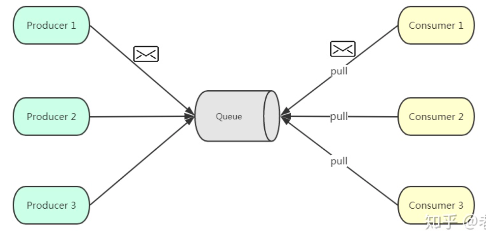
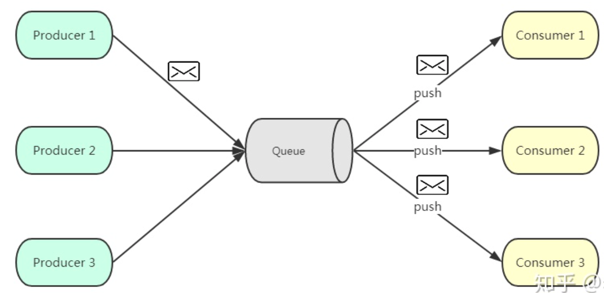
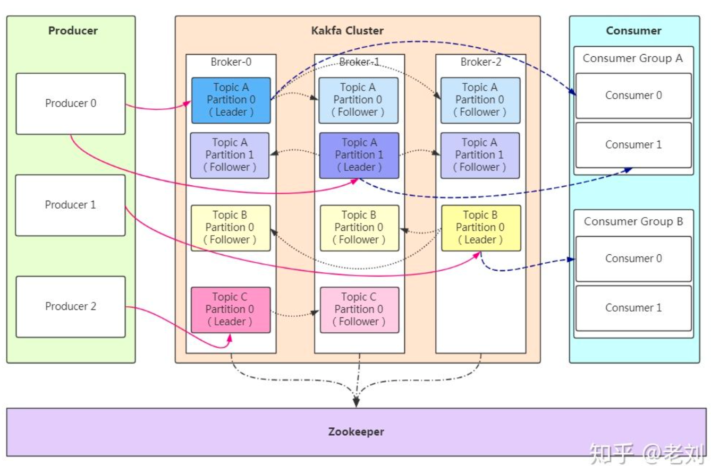
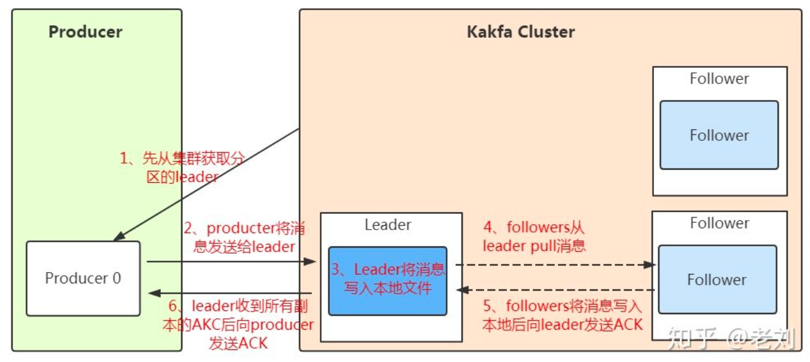
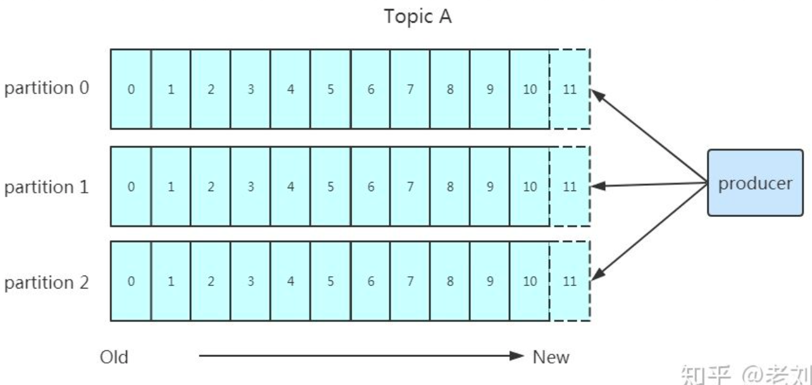
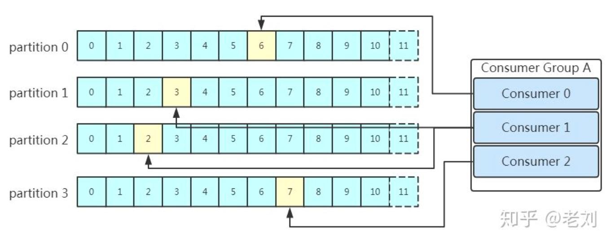

## 消息中间件好处
1. 解耦
1. 异步
1. 削峰

## 消息队列的通信模式
1. 点对点。基于**拉取**或者**轮询**的消息传送模型，发送到队列的消息被一个且只有一个消费者进行处理

1. 发布订阅


## kafka架构

1. 消费者组。同一个分区的数据只能被消费者组中的一个消费者消费；同一个消费者组的消费者可以消费同一个topic的不同分区的数据
1. producer采用发送push的方式将消息发到broker上，broker存储后。由consumer采用pull模式订阅并消费信息
1. partition是文件，支持多个副本

## 工作流程分析
### 发送数据

- 消息写入leader后，follower是主动的去leader进行同步。
- producer采用**push模式**将数据发布到broker，每条消息追加到分区中，顺序写入磁盘，保证同一分区内的数据是**有序**的。

1. 写入原则
    - 按指定partition写入
    - 按key的hash值算出partition写入【消息被均匀的分布到不同的partition中，才能实现了水平扩展】
    - 没有设置key，轮询选出一个partition
2. 消息可靠性保证
    - 0。不需要等到集群返回，不能保证消息发送成功。
    - 1。只要leader应答就可以发送下一条，只确保leader发送成功
    - all[-1]。需要所有follower都完成leader的同步才会发送下一条，确保leader发送成功和所有的副本完成备份
3. CP【一致性和分区容错性】配置
    ```sh
    request.required.acks=-1
    min.insync.replicas = ${N/2 + 1}
    unclean.leader.election.enable = false
    ```
    AP【可用性和分区容错性】配置
    ```sh
    request.required.acks=1
    min.insync.replicas = 1
    unclean.leader.election.enable = false
    ```
### kafka消息备份和同步
1. 根据分区的多副本策略来解决消息的备份问题
1. 名词解释
    1. ISR : leader 副本保持一定同步的 follower 副本, 包括 leader 副本自己，叫 In Sync Replica，最终会反馈到zookeeper上。
    1. AR: 所有副本 (replicas) 统称为 assigned replicas, 即 AR
    1. OSR: follower 同 leader 同步数据有一些延迟的节点
    1. HW: Highwater, 俗称高水位，它表示了一个特定的消息偏移量(offset), 在一个 parttion 中 consumer 只能拉取这个 offset 之前的消息(此 offset 跟 consumer offset 不是一个概念) ；
    1. LEO: LogEndOffset, 日志末端偏移量, 用来表示当前日志文件中下一条写入消息的 offset；
    1. leader HW: 该 Partititon 所有副本的 LEO 最小值；
    1. follower HW: min(follower 自身 LEO 和 leader HW)；
    1. Leader HW = 所有副本 LEO 最小值；
    1. Follower HW = min(follower 自身 LEO 和 leader HW)。
### 保存数据
> 顺序写入的方式将数据保存到磁盘

#### partition结构
> 以文件夹的方式在服务器中存储

#### message结构
1. offset。占8byte的有序id号，唯一确定每条消息在partition内的位置
1. 消息大小
1. 消息体。

#### 存储策略
1. 基于时间，默认7天；
1. 基于大小，默认128MB;

### 消费数据

1. 点对点模式。由消费者主动去kafka集群拉取消息
1. 消费者组consumer的数量与partition的数量一致

### 消费场景
1. AutoCommit（实际消息会丢）
```sh
    enable.auto.commit = true
    // 自动提交的时间间隔
    auto.commit.interval.ms
```
2. 手动commit（at least once，消息重复，重启会丢）
```sh
    // oldest:topic里最早的消息，大于commit的位置，小于HW，也受到broker上消息保留时间和位移影响，不保证一定能消费到topic起始位置的消息
    sarama.offset.initial （oldest, newest）
    // 主题偏移量日志文的保留时长，默认设为1440s
    offsets.retention.minutes
```

## 指令
1. 创建topic
```sh
./kafka-topics.sh --create --topic dev2wx --replication-factor 1 --partitions 2 --zookeeper 172.16.124.91:2181
```
2. 查看topic
```sh
./kafka-topics.sh --list --zookeeper 172.16.124.91:2181
```

## 资料
1. [简单理解kafka的消息可靠性](https://mp.weixin.qq.com/s/T6gCc8OBgyV-yeAg_MUzPQ)