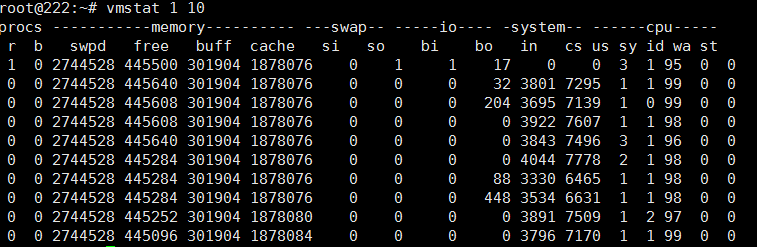
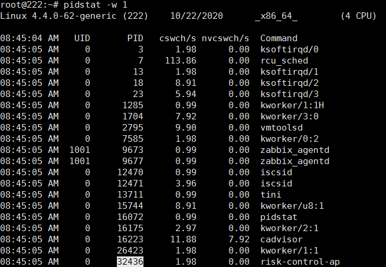

## 用户权限相关
1. `sudo gpasswd -a <你的用户名> docker`。将用户加入到某个组内，**需重启对应的服务**。需退出当前连接的用户【远程连接】

## TCP相关
1. `/proc/sys/net/ipv4/tcp_wmem`。发送缓冲区，三个值分别代表最小值，默认值，最大值
1. `/proc/sys/net/ipv4/tcp_rmem`。接收缓冲区，三个值分别代表最小值，默认值，最大值

## 内存分析
### pstree
> 线程与同一个进程内的其他线程共享同一块内存的一个特殊进程，都有自己的pid
1. `pstree`：将进程以树状展示
1. `pstree -p`：看到对应系统中的每个进程的使用线程数
1. `pstree -p pid`：某个进程的线程情况

### vmstat 
> 对操作系统整体的虚拟内存、进程、CPU活动进行监控

1. `vmstat <时间间隔> <采集次数>`

1. 参数说明
    1. `procs`
        1. r。运行和等待CPU时间片的进程数
        1. b。阻塞的进程数
    1. `Memory`
        1. swpd。虚拟内存使用情况
        1. free。当前空闲的物理内存
        1. buff。缓存的内存大小
        1. Cache。缓存的内存大小
    1. `Swap`
        1. si。有磁盘读入内存大小
        1. so。由内存写入磁盘大小
    1. `IO`
        1. bi。由块设备读入数据的总量
        1. bo。写到块设备数据的总量
    1. `System`
        1. in。每秒中断数
        1. cs。每秒产生的上下文切换次数【线程切换】
    1. `CPU`
        1. us。用户进程消耗的CPU时间百分比
        1. sy。系统调用消耗的CPU时间百分比
        1. id。CPU处在空间状态的时间百分比
        1. wa。等待IO的CPU时间
1. ### pidstat
> 用来监控全部或指定进程的cpu、内存、线程、设备IO等系统资源的占用情况

1. `pidstat -w <时间间隔>`

1. 参数说明
    1. cswch/s。每秒主动任务上下文切换数量。
    1. nvcswch/s。每秒被动任务上下文切换数量。
1. `pidstat -tt -p <pid>`

1. 参数表示
    1. TGID。主线程
    1. TID。线程id
    1. %usr。进程在用户空间占用CPU的百分比
    1. %system。进程在内核空间占用CPU的百分比
    1. %guest。进程在虚拟机占用CPU的百分比
    1. CPU。处理进程的CPU编号
    