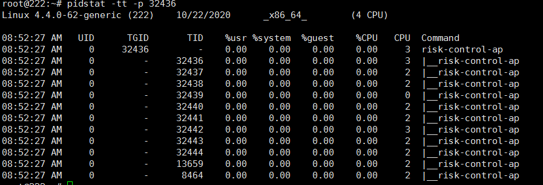

## 常用指令
1. `history`。查询用户操作日志
> export HISTTIMEFORMAT="%F %T `who -u am i 2>/dev/null| awk '{print $NF}'|sed -e 's/[()]//g'` `whoami` "

## 文件权限与目录配置

1. `sudo gpasswd -a <你的用户名> docker`。将用户加入到某个组内，**需重启对应的服务**。需退出当前连接的用户【远程连接】
2. Linux 将文件可存取的身份分为三个类别，分别是**owner**/**group**/**others**，分别具有读、写、可执行等权限
3. 在 Linux 中，任何一个文件都具有“User，Group 以及 Others”三种身份的个别权限
4. 文件权限
   
   1. 文件类型，即文件为补录、文件或链接等
      1. 目录为**d**
      2. 文件为**-**
   2. `rwx`。分别为读【4】、写【2】、执行【1】；没有权限为`-`，且都是针对某些账号来设计权限，其中写权限不包含删除
   3. `ugoa`。分别表示 user【u】、group【g】、others【o】和 all【a】
   4. `+/-`。分别表示+【增加权限】、-【减少权限】，只要没有指定到的项目，则该权限不会被改动
5. 修改权限
   1. `chgrp -R`。改变文件所属群组，要改变的群组名必须在**etc/group**文件中存在，其中`-R` 进行递归的持续变更
   2. `chown -R`。改变文件拥有者，要改变的用户名必须在**etc/passwd**文件中出现，其中`-R` 进行递归的持续变更；也可以使用`chown user.group file`来同时处理 user 变更和 group 变更
   3. `chmod`。改变文件的权限，可进行类似`chmod u=rwx,go=rx file`的授权
6. 目录权限
   1. `r`。具有读取目录结构清单的权限。
   2. `w`。
      1. 创建新的文件与目录
      2. 删除已经存在的文件与目录
      3. 将已存在的文件或目录进行更名
      4. 搬移该目录下的文件、目录位置
   3. `x`。能否进入该目录称为工作目录的用途
   4. 至少需要开放`rx`才能让任何人进行浏览
7. 目录配置
   1. FHS 定义三个目录用于放置数据，分别是/、/usr、/var。
   2. 对于根目录[/]，FHS 建议所在分区应越小越好，且应用程序所安装的软件最好不要与根目录放在同一个分区
      1. `/bin`。单人维护下还能够操作的指令。
      2. `boot`。放置开机所使用的的文件
      3. `/etc`。获取配置文件
      4. `/lib`。系统的函数库
      5. `/opt`。给第三方协力软件放置的目录
      6. `/srv`。一些网络服务启动之后，这些服务需要取用的网络数据目录
      7. `/tmp`。一般使用者主键表

## TCP 相关

1. `/proc/sys/net/ipv4/tcp_wmem`。发送缓冲区，三个值分别代表最小值，默认值，最大值
1. `/proc/sys/net/ipv4/tcp_rmem`。接收缓冲区，三个值分别代表最小值，默认值，最大值
1. `ip addr show ens33 | grep inet | awk '{ print $2; }' | sed 's/\/.*$//'`。查看 ip addr 的地址

## 查看防火墙

1. `sudo ufw app list`。查看防火墙允许的应用列表

## 内存分析

### pstree

> 线程与同一个进程内的其他线程共享同一块内存的一个特殊进程，都有自己的 pid

1. `pstree`：将进程以树状展示
1. `pstree -p`：看到对应系统中的每个进程的使用线程数
1. `pstree -p pid`：某个进程的线程情况

### vmstat

> 对操作系统整体的虚拟内存、进程、CPU 活动进行监控

1. `vmstat <时间间隔> <采集次数>`
   
1. 参数说明
   1. `procs`
      1. r。运行和等待 CPU 时间片的进程数
      1. b。阻塞的进程数
   1. `Memory`
      1. swpd。虚拟内存使用情况
      1. free。当前空闲的物理内存
      1. buff。缓存的内存大小
      1. Cache。缓存的内存大小
   1. `Swap`
      1. si。有磁盘读入内存大小
      1. so。由内存写入磁盘大小
   1. `IO`
      1. bi。由块设备读入数据的总量
      1. bo。写到块设备数据的总量
   1. `System`
      1. in。每秒中断数
      1. cs。每秒产生的上下文切换次数【线程切换】
   1. `CPU`
      1. us。用户进程消耗的 CPU 时间百分比
      1. sy。系统调用消耗的 CPU 时间百分比
      1. id。CPU 处在空间状态的时间百分比
      1. wa。等待 IO 的 CPU 时间
1. ### pidstat

   > 用来监控全部或指定进程的 cpu、内存、线程、设备 IO 等系统资源的占用情况

1. `pidstat -w <时间间隔>`
   
1. 参数说明
   1. cswch/s。每秒主动任务上下文切换数量。
   1. nvcswch/s。每秒被动任务上下文切换数量。
1. `pidstat -tt -p <pid>`
   
1. 参数表示
   1. TGID。主线程
   1. TID。线程 id
   1. %usr。进程在用户空间占用 CPU 的百分比
   1. %system。进程在内核空间占用 CPU 的百分比
   1. %guest。进程在虚拟机占用 CPU 的百分比
   1. CPU。处理进程的 CPU 编号

## 建议

1. 尽量不要使用 root 直接登录系统，应使用一般账号登录系统，有需要再转换身份
