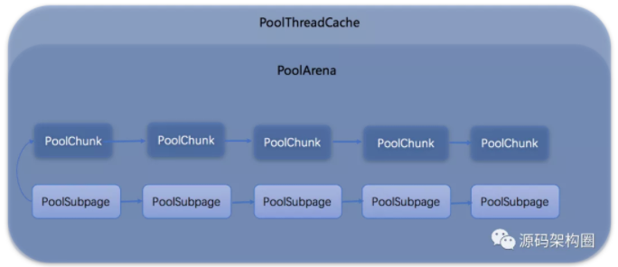
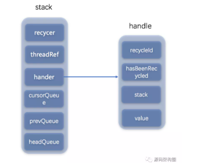
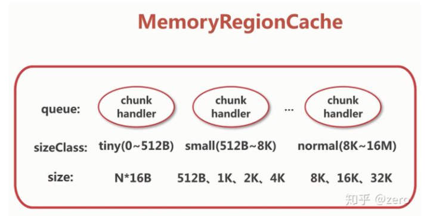
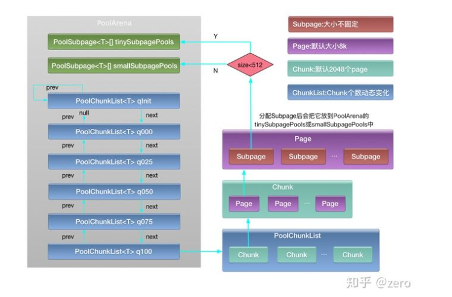

# 内存原理
> 参考Jemalloc的技术特性

1. `Arena`。将其分成许多个小块来分而治之。
1. `Thread cache`。给各自的线程thread cache领域。
## 创建堆缓冲区
```java
    public static ByteBuf buffer(int initialCapacity) {
        return ALLOC.heapBuffer(initialCapacity);
    }

    // AbstractByteBufAllocator：实现
    @Override
    public ByteBuf heapBuffer(int initialCapacity, int maxCapacity) {
        if (initialCapacity == 0 && maxCapacity == 0) {
            return emptyBuf;
        }
        // 验证参数合法性，最大的堆缓冲区容量是int最大值字节
        validate(initialCapacity, maxCapacity);
        return newHeapBuffer(initialCapacity, maxCapacity);
    }
```
## 基于内存池创建堆缓冲区
```java
    // PooledByteBufAllocator
    @Override
    protected ByteBuf newHeapBuffer(int initialCapacity, int maxCapacity) {
        // 从本地缓存内存中取
        PoolThreadCache cache = threadCache.get();
        // 获取堆内区域
        PoolArena<byte[]> heapArena = cache.heapArena;

        final ByteBuf buf;
        if (heapArena != null) {
            // 从堆区域中分配缓冲区
            buf = heapArena.allocate(cache, initialCapacity, maxCapacity);
        } else {
            // 直接分配内存
            buf = PlatformDependent.hasUnsafe() ?
                    new UnpooledUnsafeHeapByteBuf(this, initialCapacity, maxCapacity) :
                    new UnpooledHeapByteBuf(this, initialCapacity, maxCapacity);
        }
        // 检测是否有内存泄漏
        return toLeakAwareBuffer(buf);
    }

    // PoolArena
    PooledByteBuf<T> allocate(PoolThreadCache cache, int reqCapacity, int maxCapacity) {
        // 创建基于内存池的byteBuf
        PooledByteBuf<T> buf = newByteBuf(maxCapacity);
        // 分配内存
        allocate(cache, buf, reqCapacity);
        return buf;
    }
    // 按申请的内存大小进行内存分配
    private void allocate(PoolThreadCache cache, PooledByteBuf<T> buf, final int reqCapacity) {
        final int sizeIdx = size2SizeIdx(reqCapacity);

        if (sizeIdx <= smallMaxSizeIdx) {
            tcacheAllocateSmall(cache, buf, reqCapacity, sizeIdx);
        } else if (sizeIdx < nSizes) {
            tcacheAllocateNormal(cache, buf, reqCapacity, sizeIdx);
        } else {
            int normCapacity = directMemoryCacheAlignment > 0
                    ? normalizeSize(reqCapacity) : reqCapacity;
            // Huge allocations are never served via the cache so just call allocateHuge
            allocateHuge(buf, normCapacity);
        }
    }
```

## 分配的内存类型
1. 直接内存
1. 堆内存

## 基于内存池分配堆内存
```java
    // PoolArena
    @Override
    protected PooledByteBuf<byte[]> newByteBuf(int maxCapacity) {
        return HAS_UNSAFE ? PooledUnsafeHeapByteBuf.newUnsafeInstance(maxCapacity)
                : PooledHeapByteBuf.newInstance(maxCapacity);
    }

    static PooledHeapByteBuf newInstance(int maxCapacity) {
        // 从对象回收器中回收一个对象
        PooledHeapByteBuf buf = RECYCLER.get();
        buf.reuse(maxCapacity);
        return buf;
    }

    /**
     * Method must be called before reuse this {@link PooledByteBufAllocator}
     */
    final void reuse(int maxCapacity) {
        maxCapacity(maxCapacity);
        // 设置引用计数为1
        resetRefCnt();
        // 设置读写索引
        setIndex0(0, 0);
        discardMarks();
    }
```

## 内存分配总结
1. 从本地线程缓冲池中找到`poolThreadCache`，再从`poolThreadCache`中找到`heapArena`，如果有**存在**`headArena`就是开始分配内存
2. 分配内存的时候先从`对象回收器RECYCLER`中回收一个对象`PooledByteBuf`。对象回收器类似一个对象池的作用，在进行分配内存，对象可以循环利用，提供内存分配效率和JVM gc效率，这个对象回收器是基于引用计数方式实现的。
3. 分配内存
4. 0 copy
    1. 主要指用户态和内核态之间来回copy数据

## PoolThreadCache
1. 原理。给每个线程预先分配一块内存，在每个对象需要进行对象创建分配内存的时候先从本地线程缓存中获取内存，获取不到在从堆中申请内存，在一定程度上减少操作同一块内存时的锁争用
1. 结构图
    1. 数据结构：平衡二叉树
1. 组成
    1. `PoolChunk`。负责内存的分配逻辑，最小单位是一个page,**8k**,由2048个subpage组成，向OS申请的最小内存，使用完全二叉树来对组织内部的内存。
    1. `PoolChunkList`。管理`PoolChunk`的链表。
    1. `PoolSubPage`。一个内存页大小默认是**8k**


## Recycler对象池
> 基于netty的`stack`实现，采用了栈和队列实现。stack用来支持同一个线程内的对象使用和回收，把当前回收的线程和要回收对象对应的stack绑定到一个weakOrderQueue存储在当前要回收对象所在的stack中，之所以这样设计在并发情况下**一个线程绑定一个队列减少多个线程之间的锁争用提供应用的并发度**



```java
    // 队列
    static WeakOrderQueue newQueue(Stack<?> stack, Thread thread) {
        // We allocated a Link so reserve the space
        if (!Head.reserveSpaceForLink(stack.availableSharedCapacity)) {
            return null;
        }
        final WeakOrderQueue queue = new WeakOrderQueue(stack, thread);
        // Done outside of the constructor to ensure WeakOrderQueue.this does not escape the constructor and so
        // may be accessed while its still constructed.
        // headQueue对象是用来维护在多线程情况下并发回收的时候标识其他线程和当前要回收对象所在stack的映射关系.
        stack.setHead(queue);

        return queue;
    }
```

### 处理回收DefaultHandler
```java
    private static final class DefaultHandle<T> implements Handle<T> {
        // 标记对象回收的id
        int lastRecycledId;
        // 标记当前要回收的对象id
        int recycleId;
        // 标记对象是否回收
        boolean hasBeenRecycled;

        Stack<?> stack;
        // 具体回收对象
        Object value;

        DefaultHandle(Stack<?> stack) {
            this.stack = stack;
        }
        // 具体回收业务处理
        @Override
        public void recycle(Object object) {
            if (object != value) {
                throw new IllegalArgumentException("object does not belong to handle");
            }

            Stack<?> stack = this.stack;
            // 如果ID不一致，则表示已经回收
            if (lastRecycledId != recycleId || stack == null) {
                throw new IllegalStateException("recycled already");
            }            
            stack.push(this);
        }
    }
    void push(DefaultHandle<?> item) {
        Thread currentThread = Thread.currentThread();
        // 当前线程回收对象
        if (threadRef.get() == currentThread) {
            // The current Thread is the thread that belongs to the Stack, we can try to push the object now.
            // 当前线程是属于堆栈的线程，尝试推对象
            pushNow(item);
        } else {
            // The current Thread is not the one that belongs to the Stack
            // (or the Thread that belonged to the Stack was collected already), we need to signal that the push
            // happens later.
            // 当前线程不属于堆栈的对象，在后面发出push发生的信号
            pushLater(item, currentThread);
        }
    }
```

## 命中逻辑及内存回收
1. 内存规格

1. 内存分配流程
    1. PoolThreadCache。线程独有的内存仓库
    1. PoolArean。几个线程共享的内存仓库
    1. 全局变量指向的内存仓库，为所有线程共用
    1. PoolChunck。向OS申请的最小内存，默认为16M
    1. Page。PoolChunk所能管理的最小内存，PageSize默认为8k
    
1. 堆外内存回收

```java
abstract class PooledByteBuf<T> extends AbstractReferenceCountedByteBuf {

  @Override
    protected final void deallocate() {
        if (handle >= 0) {
            final long handle = this.handle;
            // 当前的ByteBuf不再指向任何一块内存
            this.handle = -1;
            memory = null;
            // 将ByteBuf的内存释放
            chunk.arena.free(chunk, tmpNioBuf, handle, maxLength, cache);
            tmpNioBuf = null;
            chunk = null;
            // 将对象放入的对象回收站，循环利用
            recycle();
        }
    }
}
```

4. ByteBuf释放内存

```java
void free(PoolChunk<T> chunk, ByteBuffer nioBuffer, long handle, int normCapacity, PoolThreadCache cache) {
        if (chunk.unpooled) {
            int size = chunk.chunkSize();
            destroyChunk(chunk);
            activeBytesHuge.add(-size);
            deallocationsHuge.increment();
        } else {
            SizeClass sizeClass = sizeClass(handle);
            if (cache != null && cache.add(this, chunk, nioBuffer, handle, normCapacity, sizeClass)) {
                // cached so not free it.
                return;
            }

            freeChunk(chunk, handle, normCapacity, sizeClass, nioBuffer, false);
        }
    }
```
