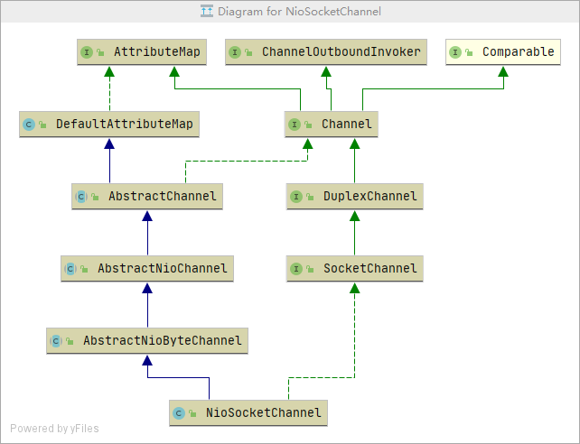

## channel源码
> 简介到网络套接字或IO操作的组件，如读、写、连接和绑定。类图如下：

1. `ChannelPipeline`。拦截器链表，维护一个`ChannelHandler`链表，针对`ChannelHandler`做添加、删除的逻辑处理以及channel的触发操作和上下文。
1. `Unsafe`。数据传输
1. `AbstractNioChannel`。NIO的基本操作
1. 通过`pipeline`来进行事件操作和流转。