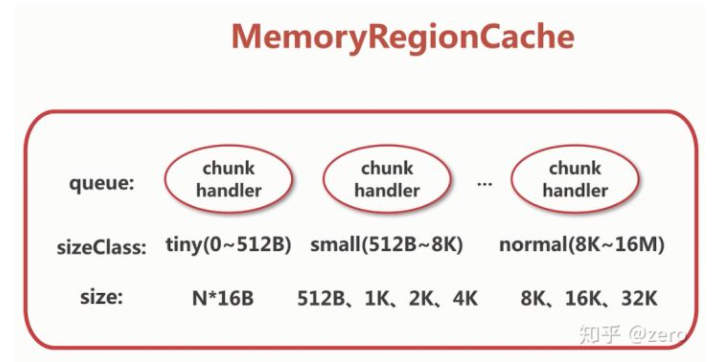
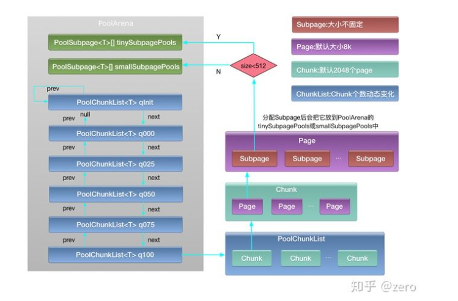

## channel源码
- 简介到网络套接字或IO操作的组件，如读、写、连接和绑定。类图如下：

1. `Unsafe`。用于数据传输
1. `AbstractNioChannel`。NIO的基本操作
1. 通过`pipeline`来进行事件操作和流转。

## ChannelPipeline
> 拦截器，维护ChannelHandler列表，类似于servlet和filter的关系
### 创建
- 每个通道都有自己的管道，它会在创建新通道时自动创建
### 特性
1. 支持运行时动态添加或删除`ChannelHandler`,线程安全
### 流程图如下

1. `ChannelInboundHandler`。监控Channel状态变化，API如下图所示：

1. `ChannelOutboundHandler`。拦截IO事件，API如下图所示：


## Eventloop
- 处理注册在channel上的所有IO操作，事件循环器【单线程】
1. `EventExecutor`。事件执行器，负责处理事件
1. `EventExecutorGroup`。维护了一个EventExecutor链表，继承了ScheduledExecutorService，execute方法通过next方法选择一个EventExecutor，并调用EventLoop#execute处理事件
1. `EventloopGroup`。负责调度Eventloop
1. `NioEventloop`。
    - 启动流程如下图：
    
    - 实例化流程图如下：
    
    - 与`Channel`的关联图如下：
    
## ByteBuf
### ByteBuf简介
1. 创建buffer使用Unpooled或Pooled。
1. `discardable bytes`。无效空间，可丢弃字节的区域
1. `readable bytes`。内容空间，可读字节的区域，由readerIndex和writerIndex指针控制
1. `writable bytes`。空闲空间，可写入字节的区域，由writerIndex指针和capacity容量控制
1. 索引顺序存储。

1. Discardable bytes。回收未使用区域如下图所示：

1. 清除缓存索引。


### 命中逻辑及内存回收
1. 内存规格

1. 内存分配流程
    1. PoolThreadCache。线程独有的内存仓库
    1. PoolArean。几个线程共享的内存仓库
    1. 全局变量指向的内存仓库，为所有线程共用
    1. PoolChunck。向OS申请的最小内存，默认为16M
    1. Page。PoolChunk所能管理的最小内存，PageSize默认为8k
    
1. 堆外内存回收
```java
abstract class PooledByteBuf<T> extends AbstractReferenceCountedByteBuf {

  @Override
    protected final void deallocate() {
        if (handle >= 0) {
            final long handle = this.handle;
            // 当前的ByteBuf不再指向任何一块内存
            this.handle = -1;
            memory = null;
            // 将ByteBuf的内存释放
            chunk.arena.free(chunk, tmpNioBuf, handle, maxLength, cache);
            tmpNioBuf = null;
            chunk = null;
            // 将对象放入的对象回收站，循环利用
            recycle();
        }
    }
}
```
1. ByteBuf释放内存
```java
void free(PoolChunk<T> chunk, ByteBuffer nioBuffer, long handle, int normCapacity, PoolThreadCache cache) {
        if (chunk.unpooled) {
            int size = chunk.chunkSize();
            destroyChunk(chunk);
            activeBytesHuge.add(-size);
            deallocationsHuge.increment();
        } else {
            SizeClass sizeClass = sizeClass(handle);
            if (cache != null && cache.add(this, chunk, nioBuffer, handle, normCapacity, sizeClass)) {
                // cached so not free it.
                return;
            }

            freeChunk(chunk, handle, normCapacity, sizeClass, nioBuffer, false);
        }
    }
```
1. 对象放入回收站，循环利用
```java
public abstract class Recycler<T> {
@Override
        public void recycle(Object object) {
            if (object != value) {
                throw new IllegalArgumentException("object does not belong to handle");
            }

            Stack<?> stack = this.stack;
            if (lastRecycledId != recycleId || stack == null) {
                throw new IllegalStateException("recycled already");
            }

            stack.push(this);
        }
}
```