## channel 源码

- 简介到网络套接字或 IO 操作的组件，如读、写、连接和绑定。类图如下：
  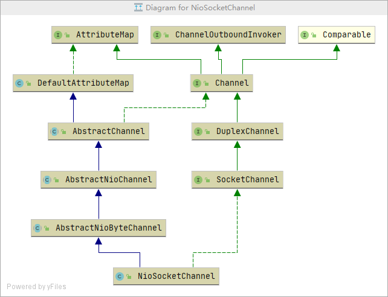

1. `Unsafe`。用于数据传输
1. `AbstractNioChannel`。NIO 的基本操作
1. 通过`pipeline`来进行事件操作和流转。

## ChannelPipeline

> 拦截器，维护 ChannelHandler 列表，类似于 servlet 和 filter 的关系

### 创建

- 每个通道都有自己的管道，它会在创建新通道时自动创建

### 特性

1. 支持运行时动态添加或删除`ChannelHandler`,线程安全

### 流程图如下

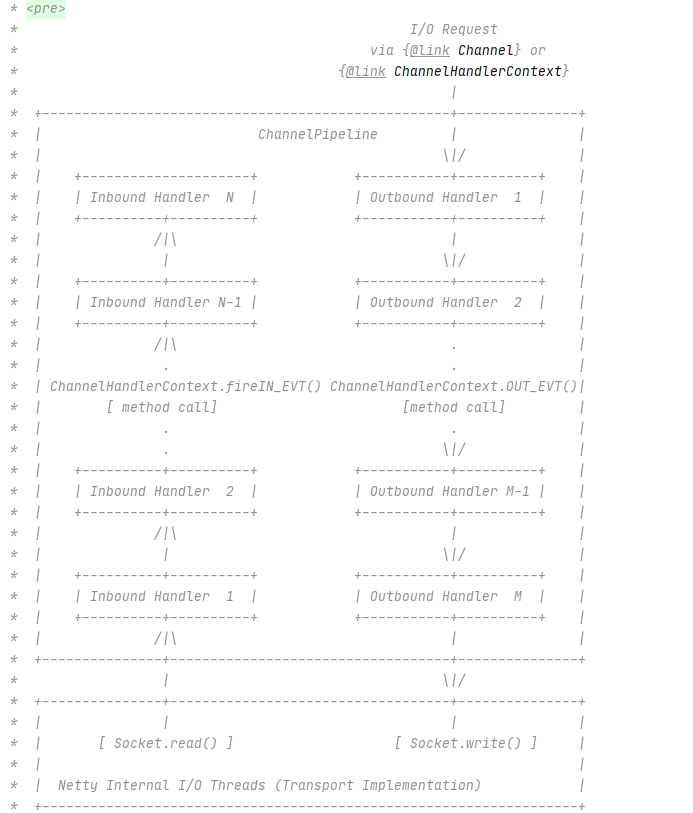

1. `ChannelInboundHandler`。监控 Channel 状态变化，API 如下图所示：
   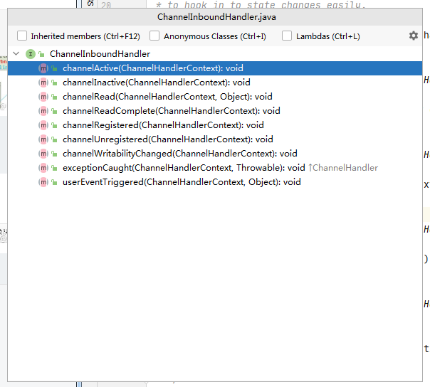
1. `ChannelOutboundHandler`。拦截 IO 事件，API 如下图所示：
   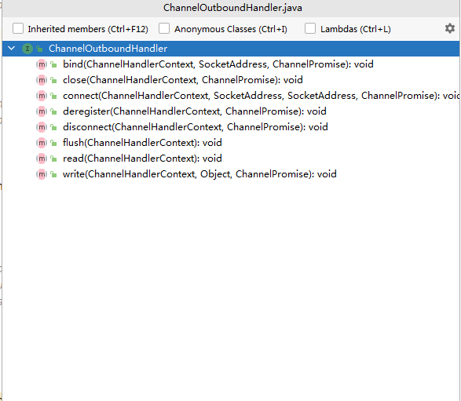

## Eventloop

- 处理注册在 channel 上的所有 IO 操作，事件循环器【单线程】,简单流程图如下：
  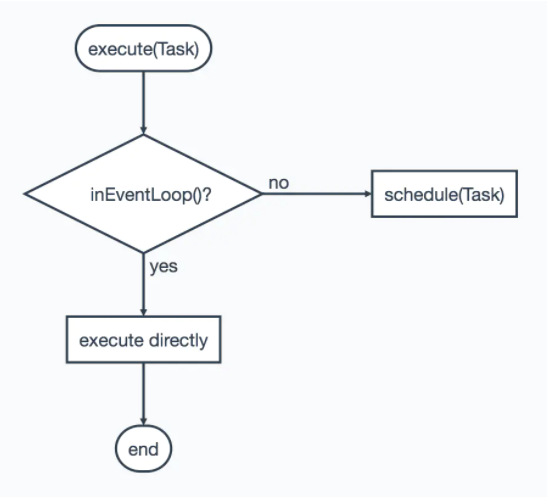

1. `EventExecutor`。事件执行器，负责处理事件
1. `EventExecutorGroup`。维护了一个 EventExecutor 链表，继承了 ScheduledExecutorService，execute 方法通过 next 方法选择一个 EventExecutor，并调用 EventLoop#execute 处理事件
1. `EventloopGroup`。负责调度 Eventloop
1. `NioEventloop`。
   - 启动流程如下图：
     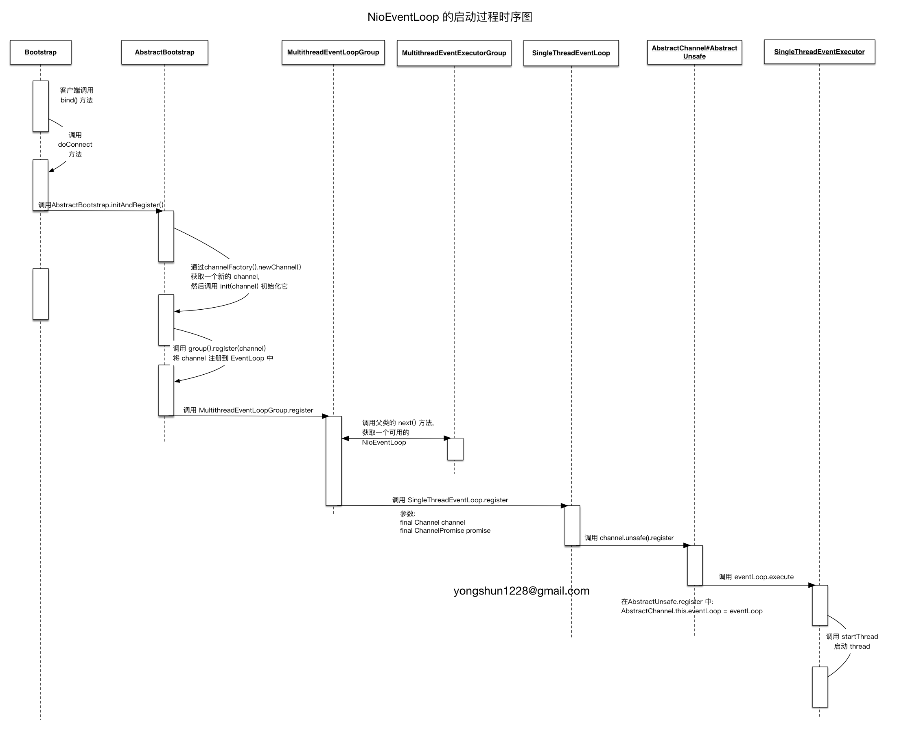
   - 实例化流程图如下：
     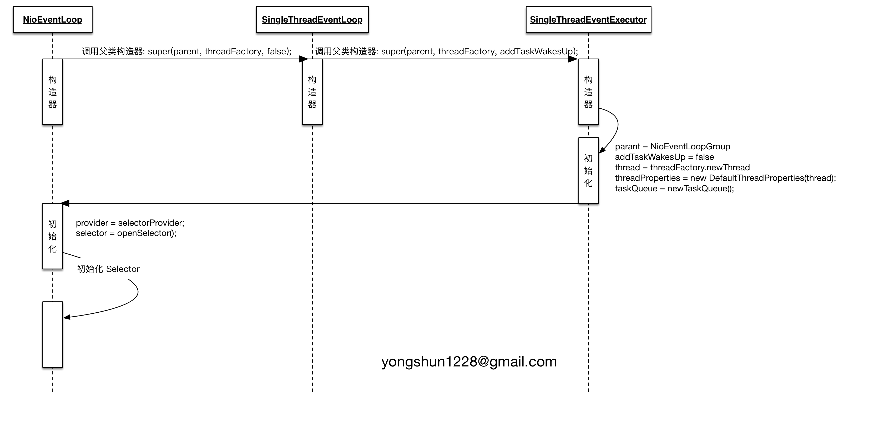
   - 与`Channel`的关联图如下：
     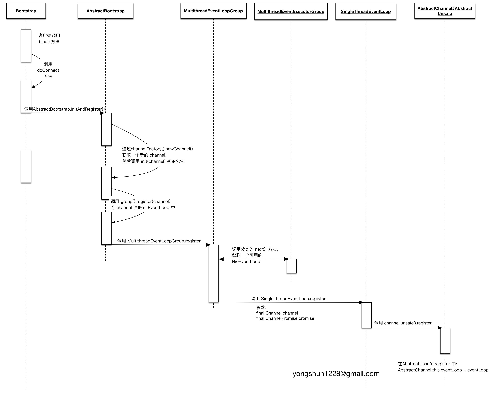

## ByteBuf

### ByteBuf 简介

1. 创建 buffer 使用 Unpooled 或 Pooled。
1. `discardable bytes`。无效空间，可丢弃字节的区域
1. `readable bytes`。内容空间，可读字节的区域，由 readerIndex 和 writerIndex 指针控制
1. `writable bytes`。空闲空间，可写入字节的区域，由 writerIndex 指针和 capacity 容量控制
1. 索引顺序存储。
   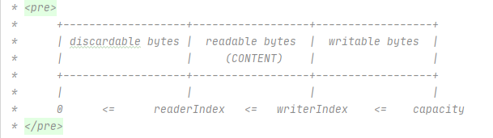
1. Discardable bytes。回收未使用区域如下图所示：
   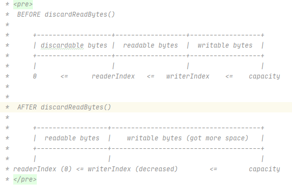
1. 清除缓存索引。
   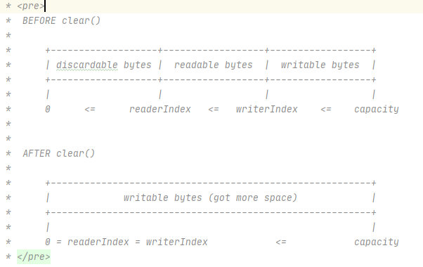

## FastThreadLocal

1. **ThreadLocal**。每一个线程绑定了一个基于线性探测法的 HashMap 来存储数据，key 为当前 ThreadLocal 对象，通过 ThreadLocal 来定位所存储的 value
1. **FastThreadLocal**。每一个 FastThreadLocalThread 线程绑定一个 Object[]数据来存储数据，FastThreadLocal 内部存储了一个索引值，利用该索引直接在数组中定位所存储的元素
