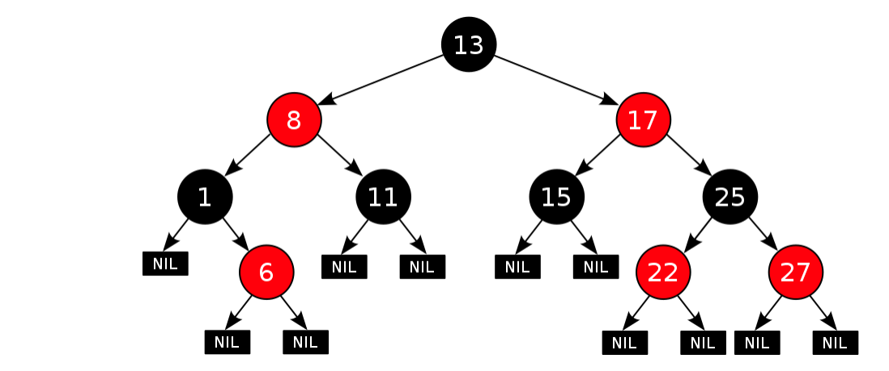
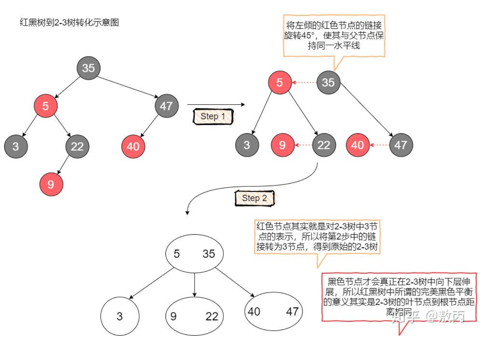
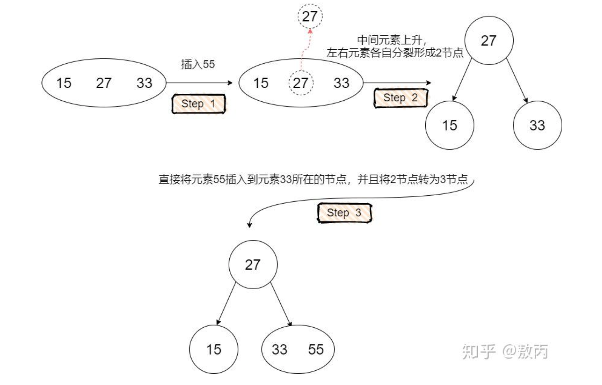
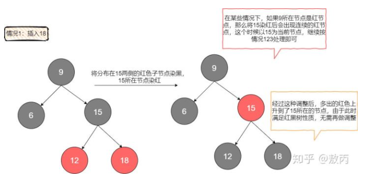
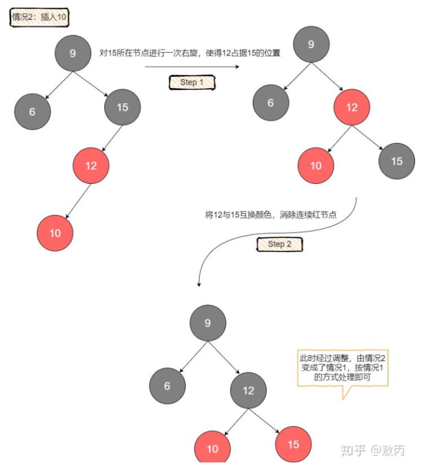
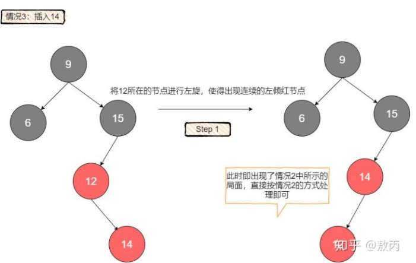
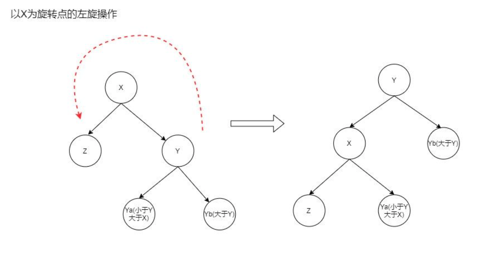
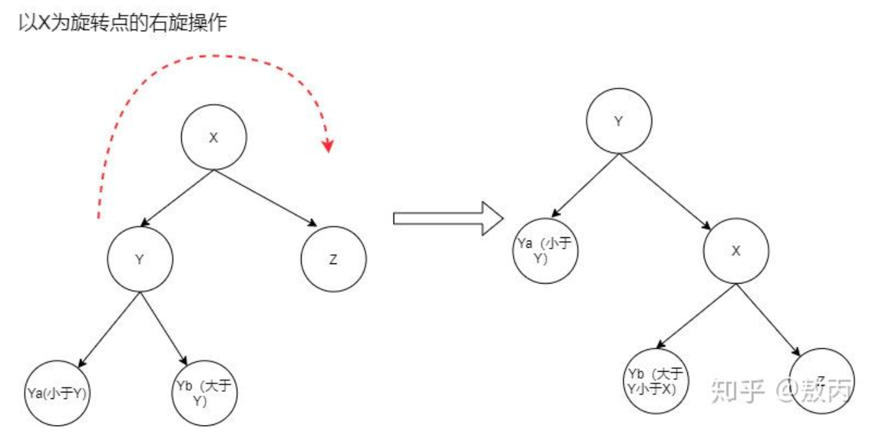

# 红黑树

## 面试问题

1. 能否给出完整定义
1. 能否介绍自己对红黑树的理解
1. 能否通过旋转、染色等操作在给定的场景下对一棵红黑树进行调整使其符合定义

## 红黑树的本质

是**2-3-4 树**的一种实现。阶数为 4 的 B 树【平衡树】，主要用来做查找
**平衡**的定义。从空链接到根节点距离相等，非叶子节点是不会存在空键接。
**左倾红黑树**。只允许以左侧红色子节点形式出现，红色节点顺时针方向旋转 45 度。红黑树到 2-3 树的转化：

**完美黑色平衡**。2-3 树的叶节点到根节点距离相同。
**目的**。尽可能保证二叉查找树中的元素尽量均衡的分布在树的两侧。

## 红黑树的特性

- 从根到叶子的最长的可能路径不多于最短的可能路径的两倍长。

## 红黑树的操作

1. 2-3 树插入。

- 原则。将这个元素常识性地放在已经存在的节点上
  

1. 2-3 树 2 节点删除

- 除非当前节点是根节点，否则当前节点的父节点一定是一个非 2 节点。

1. 左倾红黑树的**插入**
   1. 待插入元素比黑父大，插在了黑父的右边，而黑父左边是红色儿子。
   
   1. 待插入元素比红父小，且红父自身就是左倾。
   
   1. 待插入元素比红父大，且红父自身就是左倾。
   
1. 左倾红黑树的**删除**
   - 选择它的前驱节点或者后继节点元素来替代它，转而删除它的前驱/后继节点。

## 红黑树的 5 条定义

1. 节点颜色有红色和黑色
1. 根节点必为黑色
1. 所有叶子节点都是黑色
1. 任意节点到叶子节点经过的黑色节点数目相同
1. 不会有连续的红色节点

## 二叉查找树

1. 节点有一个元素和两个指针域，左指针指向小于 X 的元素,右指针指向大于 X 的元素.

## 树的旋转

- 旋转是二叉树调平的精髓。

1. 左旋【逆时针】
   
1. 右旋【顺时针】
   

## 总结

1. 3 个一组，左插左旋，右插右旋，中间晋升；
1. 一维列表，分组递归，代表排序，逐级上升；
1. 增删改查，定位小组，重复上述，得到答案。

## 资料

1. [什么是红黑树](https://zhuanlan.zhihu.com/p/273829162)
1. [红黑树——维基百科](https://zh.wikipedia.org/wiki/%E7%BA%A2%E9%BB%91%E6%A0%91)
