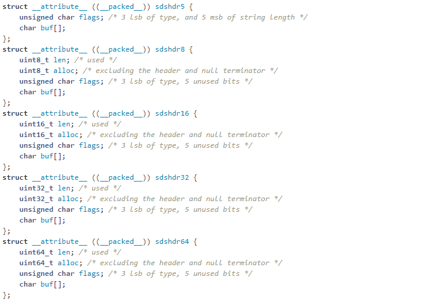
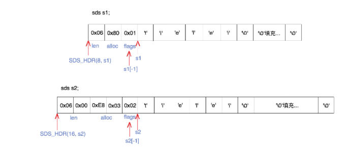
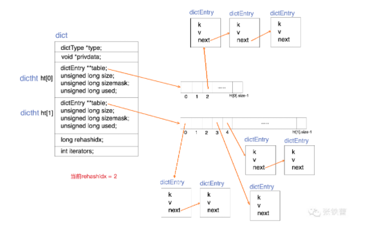

# 数据类型

## keys

1. 二进制安全，空字符串也是有效的键
2. 规则
   - 键不能太长。可以使用 SHA1 来对大值进行处理
   - 键也不能太短。

### 自动创建和删除键

1. 规则。
   - 添加到聚合数据类型时，如果目标键不存在，则在添加元素之前会创建一个空的聚合数据类型。
   - 删除聚合数据类型中的元素时，如果该值保持为空，则键将被自动销毁
   - 调用带空键的只读或写命令删除元素，总会产生与键保持空的聚合类型相同的结果

## expires

1. 到期时间分辨率始终为**1 毫秒**

### LRU 算法

1. 配置`maxmemory`来限制 redis 的内存使用，超过部分执行策略来释放内存

## 外部数据结构

### STRING（字符串）

1. 二进制安全，最大长度为 512MB
2. 编码为 int/raw/embstr
   - embstr。字符串对象的长度小于**44**字节，使用 embstr 对象。创建只会分配一次内存，使用 malloc 方法一次分配
   - raw。需要使用两次 malloc 方法，两个对象头在内存地址上一般不是连续的
3. sds（Simple Dynamic String）字符串结构。string 的底层实现
   - 可动态扩展内存
   - 二进制安全
   - 兼容传统的 C 语言字符串类型

### LIST（列表）

1. 根据插入**顺序排序**的字符串元素的集合，基于**双向链表**实现。插入或删除快，查找慢。
2. 方法
   - `LPUSH`命令将新元素从列表的**头部**添加
   - `RPUSH`命令将新元素从列表的**尾部**添加
   - `LTRIM`命令限制列表可查看的数据量
   - `BRPOP`和`BLPOP`。仅当将元素添加到列表中或用户指定的超时时间到时，能等待元素到来而不是采用轮训的方式。
3. 列表的最大长度是 2^32-1 个元素（一个列表多达 40 多亿的数据）
4. 编码为**ziplist**或**linkedlist**
   - ziplist。压缩链表，节省内存空间【数据量不能太大】
   - linkedlist。双向链表

### HASH（哈希）

1. 由与值相关联的字段组成的映射。字段和值都是字符串
2. 方法
   - `HINCRBY`。按增量递增存储在键处存储的哈希中字段中存储的数字，返回的是增加操作后的值

### SET（集合）

1. 唯一、未排序的字符串元素的集合

### ZSET（排序集合）

1. 每个字符串元素都与一个浮点数字值相关联

### Bit arrays（位图）

1. 像位数组一样处理字符串

### HyperLogLogs（概率数据结构）

1. 用于估计集合的基数

### streams（流）

1. 抽象日志数据类型，仅追加 map 数据类型的集合

## 内部数据结构

### sds

1. 内部结构
   
2. 内存结构
   
3. 按字符串的使用大小来设置多个头部格式，不按动态头部来设置
   - header。
     1. len: 表示字符串的真正长度（不包含 NULL 结束符在内）。
     2. alloc: 表示字符串的最大容量（不包含最后多余的那个字节）。
     3. flags: **总是占用一个字节**。其中的最低 3 个 bit 用来表示 header 的类型
   - 字符串数组。
4. 动态扩容
   - 原则。新长度=(新增加长度+原长度)>(1024 _ 1024)?(新增长度+原长度) + (1024 _ 1024) :(新增加长度+原长度) \* 2。可能会涉及对 header 类型的修改
   - 具体实现。
     1. `sdsMakeRoomFor`方法实现扩容。
     2. `sdscatlen`方法实现扩容策略。
5. 与C语言字符串的区别
   - 获取字符串长度：O(1)
   - 杜绝缓冲区溢出
   - 减少修改字符串时带来的内存重分配次数
6. 资料
   - [sds 数据结构详解（推荐）](http://zhangtielei.com/posts/blog-redis-sds.html)
   - [SDS 扩容](https://blog.csdn.net/weixin_40318210/article/details/85316315)
   - [sds 源文件 sds.c](https://github.com/redis/redis/blob/unstable/src/sds.c)
   - [sds 源文件 sds.h](https://github.com/redis/redis/blob/unstable/src/sds.h)
   - [深入浅出 redis sds](https://blog.csdn.net/qq193423571/article/details/81637075)
   - [全网最细节的 sds 讲解（推荐）](https://zhuanlan.zhihu.com/p/269496479)

### dict

1. 一个用于维护key和value映射关系的数据结构【基于哈希表的算法】，为解决算法中的查找问题。
2. 特点。采用**增量式重哈希**的方法，避免一次性对所有key进行重哈希，在查找、插入、删除时都会触发重哈希
3. 数据结构。定义两个哈希表用于重哈希

4. 资料
   - [dict原理](http://zhangtielei.com/posts/blog-redis-dict.html)

### ziplist

1. 定义。是经过特殊编码的双向链表，存储字符串和整数值，整数被编码为实际整数，而不是一系列字符，按小端存储。是一个连续的内存空间，将一些必要的偏移量信息记录在节点里，能跳到上一个节点或下一个节点
2. 内存结构
   

   - `zlbytes`。表示 ziplist 占用的字节总数（4 个字节）
   - `zltail`。表示 ziplist 表中最后一项（entry）在 ziplist 中的偏移字节数。可以很方便地找到最后一项（不用遍历整个 ziplist），从而可以在 ziplist 尾端快速地执行 push 或 pop 操作。
   - `zllen`。数据项（entry）的个数，2^16-1（2 个字节）
   - `entry`。真正存放数据的数据项，长度不确定

     1. 内部结构

        

        - `prevlen`。记录上一个节点的长度
        - `encoding`。当前节点的编码规则
        - `data`。当前节点的值

   - `zlend`。结束标识，固定值（255）

3. 资料
   - [Redis 内部数据结构详解(4)——ziplist](http://zhangtielei.com/posts/blog-redis-ziplist.html)
   - [redis ziplist 源码分析](https://segmentfault.com/a/1190000017328042)
   - [redis 源码分析](https://segmentfault.com/a/1190000016901154)

## 资料

1. [Redis 内部数据结构详解](http://zhangtielei.com/posts/blog-redis-dict.html)
2. [值得一看的 35 个 Redis 面试题总结](https://segmentfault.com/a/1190000022381177)
3. [redis 文章](https://www.cnblogs.com/shoshana-kong/tag/redis/)
4. [redis 官方文档](https://redis.io/topics/data-types-intro)
5. [redis 官方文档译文](http://ifeve.com/redis-data-types/)
6. [redis 设计与实现](http://redisbook.com/index.html)
