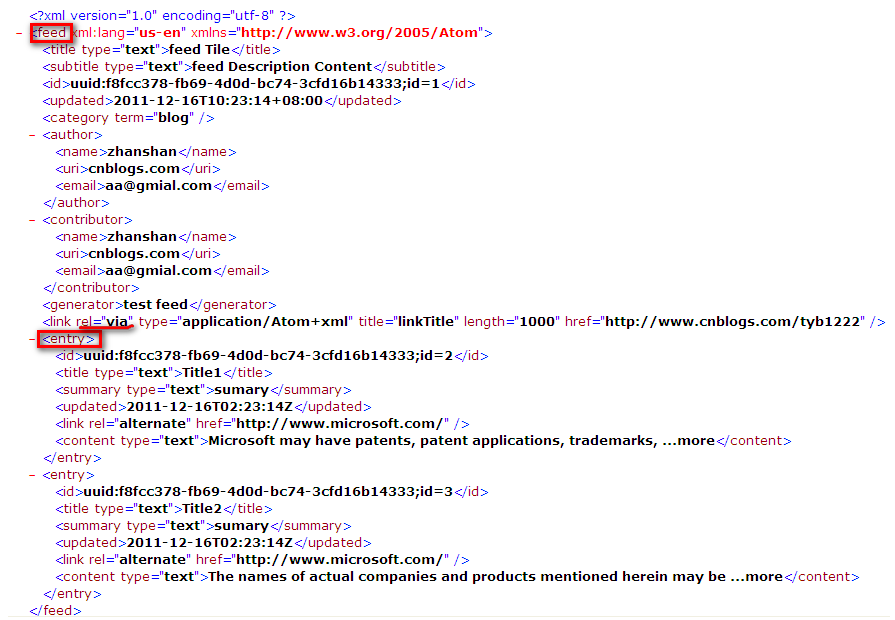

## 定义
一对协议，Atom Syndication Format和Atom Publishing Protocol (简称AtomPub)。一种**基于XML**的超媒体格式标准。

## demo

## 基本概念
### 提要(feed)
1. id
在提要生命周期中永久的、唯一的标识符
2. title
提要为我们提供的可读标题
3. subTitle
为提要的源信息
4. category
提要分类。由其term属性的Value指定。此外有两个可选属性：Label、Scheme，前者表示我们可以理解的表述，后者标识了此分类所属方案
5. updated
提要最新更新时间
6. link
获取提要的URI

### 条目（entry）
条目(entry)是构成提要(feed)的带有时间戳数据实体。一个提要中包含一个或多个条目。虽然条目(entry)一般都是包含在提要(feed)中，但是他们都可以单独作为可寻址的资源来被消费者使用。

## 资料
1. [一种标准的超媒体格式：atom](https://www.cnblogs.com/tyb1222/archive/2011/12/16/2290053.html)