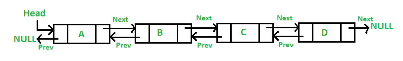

# 双向链表

## 定义

一个节点有两个方向，分别储存当前节点的前驱节点和后续节点

## Golang
1. container/list。基于双向链表实现

## 原型图



## 操作

1. 删除需指定前驱结点或后驱结点
2. 添加需要2个指向

## 实现思路
1. 定义结点（包含数据和头尾指针）
2. 数据插入
    1. 头部插入，流程图如下：
    ```mermaid
    graph TD
    A(新节点)
        A --> B{链表是否为空}
        B --> |是| C[尾指针指向下一个新增结点]
        B --> |否| D[头指针指向前一个结点 尾指针指向下一个结点]
        E[头结点插入]
    ```
    2.  尾部插入
    ```mermaid
    graph TD
    A(新结点) -->B[头指针指向前一个节点 尾指针为null]
        C[尾结点插入]
    ```
    3. 插入中间结点
    ```mermaid
    graph TD
    A(新结点) -->B[头指针指向前一个结点 尾结点指向下一个结点]
    -->C[前一个结点的尾结点指向新结点] -->D[后一个结点的头结点指向新结点]
        E[中间结点插入]
    ```
3. 数据删除
    1. 头部删除，流程图如下：
    ```mermaid
    graph TD
    A(查找头结点) -->B[获取头结点的下一个结点]
    -->C[头结点的下一个结点的头指针设为null] -->D[将下一个结点作为头结点]
        E[头结点删除]
    ```
    2.  尾部删除
    ```mermaid
    graph TD
    A(查找尾结点) -->B[通过头指针获取尾结点的上一个结点]
    -->C[尾结点的上一个结点的尾指针设为null] -->D[将上一个结点作为尾结点]
        C[尾结点删除]
    ```
    3. 删除中间结点
    ```mermaid
    graph TD
    A(查找要删除结点的前后结点) -->B[当前结点的尾指针赋给前结点的尾指针]
    -->C[要删除结点的头指针赋给后结点的头指针] -->D[移除要删除结点]
        E[中间结点插入]
    ```


# 资料
1. [数据结构](https://www.geeksforgeeks.org/data-structures/)
2. [双向链表](https://zhuanlan.zhihu.com/p/105956446)