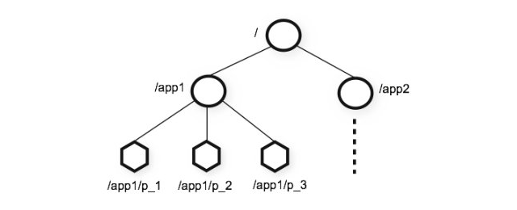
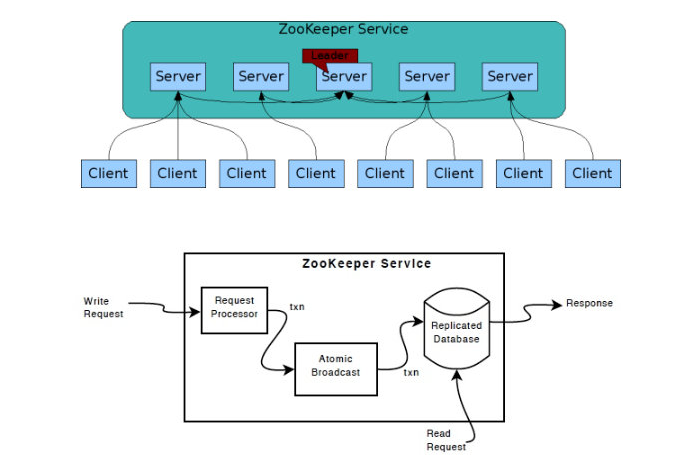

## 作用
在分布式系统中协作多个任务

## 进程间通信
使用共享存储模型，即开发的应用是从连接到zookeeper服务器端的客户端，他们连接到zookeeper服务器进行相关的操作，来影响服务器端存储的共享数据，最终应用间实现协作

## 不适合的场景
海量数据存储

## 数据结构
1. 采用类似文件系统的层级树状结构管理Znode
2. Znode 的节点类型。
    1. 在新建 znode 节点。需要指定该节点的类型，不同的类型决定了 znode 节点的行为方式，znode 的类型分为**持久节点**、**时节点**、**有序节点**，**组合** 4 中类型，持久的，临时的，持久有序的，临时有序的

    2. 持久节点。只能主动删除
    3. 临时节点。该节点的客户端崩溃或关闭连接时会删除
    4. 有序节点。被分配唯一一个单调递增的整数

## 监视和通知
客户端获得服务器的数据或变化是基于通知的机制，**单次触发**

## 架构

### 模式
1. 独立模式。部署单个服务
2. 仲裁模式【集群模式】。采用ZAB协议保证分布式数据一致性

### 内部原理
1. 请求、事务、标识符。
    1. 请求由本地服务器完成并返回状态。
    2. 事务。数据更新有leader完成，以原子方式执行并具有幂等性
    3. 标识符。包含时间戳和计数器，指事务的标识符【会话ID】
2. 选举过程。
    1. 将接收的 voteId 和 voteZxid 作为一个标识符，并获取接收方当前的投票中的 zxid，用 myZxid 和 mySid 表示接收方服务器自己的值。
    2. 如果（voteZxid > myZxid）或者（voteZxid == myZxid 且 voteId >mySid）,保留当前的投票信息。
    3. 否则，修改自己的投票信息，将 voteZxid 赋值给 myZxid，将 voteId 赋值给 mySid。
    结论。**最新的服务器**将赢得选举，因为其拥有最近一次的 zxid。如果多个服务器拥有的最新的 zxid 值，其中的 **sid 值最大**的将会赢得选举。
3. ZAB协议【状态更新原子广播协议，类似于两阶段提交】。
    1. 群首向所有追随者发送一个 PROPOSAL 消息 p。
    2. 当一个追随者接收到消息 p 后，会响应群首一个 ACK 消息，通知群首其已接受该提案（proposal）。
    3. 当收到仲裁数量的服务器发送的确认消息后（该仲裁数包括群首自己），群首就会发送消息通知追随者进行提交（COMMIT）操作。
4. 观察者【配置中增加observer】
    1. 提高读请求的可扩展性。
    2. 跨多个数据中心部署。
    3. 不参与选举。
5. 服务器
    1. 独立服务器
    2. 群首服务器【leader】，负责状态更新。持久化事务的磁盘中
    3. 追随者和观察者服务器。追随者服务器用于接收和处理客户端请求和处理leader服务器的事务；观察者服务器不需要去人消息也不处理事务，只用于查询
6. 本地存储
    1. 日志和磁盘。通过日志来持久化事务，**写事务日志是写请求操作的关键路径**。
    2. 快照。zookeeper数据树的拷贝副本。
7. 服务器与会话
    1. 由leader服务器来跟踪和维护session
    2. leader每半个tick发送一个ping信息给follower
8. 监视点【一次性触发】
9. 客户端
10. 序列化
采用Jute来做序列化
## 资料
1. [zookeeper官网](https://zookeeper.apache.org/)
2. [zookeeper实践](https://zhuanlan.zhihu.com/p/134549250)
3. [zookeeper监控](https://blog.csdn.net/qq_25934401/article/details/84345905)